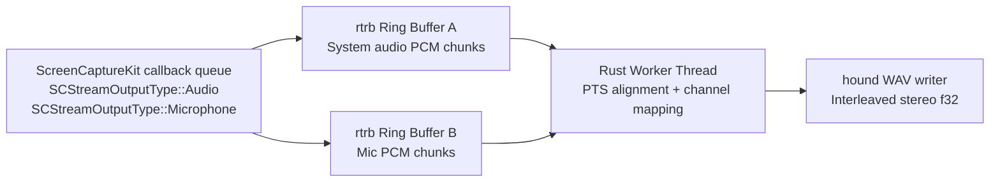

# Real-Time Architecture

## Threading Contract

Callback thread (high priority):
- Accept `CMSampleBuffer` from SCK.
- Convert/copy into preallocated chunk slots.
- Push into lock-free SPSC ring.
- No mutex, no heap growth, no disk I/O.

Worker thread (normal priority):
- Pop mic/system chunks.
- Align by PTS in one timeline.
- Downmix each source to mono.
- Interleave stereo (`L=mic`, `R=system`).
- Write WAV frames to disk.

## Buffer Data Contract

Per chunk:
- `kind`: `Audio` or `Microphone`
- `pts_seconds`: `CMSampleBuffer.presentation_timestamp()`
- `sample_rate_hz`
- `mono_samples: [f32; N]` (or fixed-capacity block + valid length)

## Interleave Rules

- Base timeline origin:
  - `base_pts = min(first_mic_pts, first_system_pts)`
- Placement:
  - `start_index = round((pts - base_pts) * sample_rate)`
- Stereo write:
  - frame `i`: `left = mic[i]`, `right = system[i]`

## Failure and Recovery

- If `SCStreamErrorSystemStoppedStream` occurs, restart stream and continue into new segment.
- Sample-rate mismatch policy is explicit:
  - `strict`: fail fast if mic/system rates do not both match the requested target rate.
  - `adapt-stream-rate` (default): keep requested target as canonical output rate and resample mismatched chunks in the worker path.
  - recorder telemetry includes a `sample_rate_policy` section with mode, input rates, and resample counters.

## Prototype in Repo

- Probe: `src/main.rs`
- WAV recorder: `src/bin/sequoia_capture.rs`
- Build/run orchestration: `Makefile`

## Execution Modes

- Debug recorder (`make capture` / `cargo run --bin sequoia_capture`):
  - writes output relative to current shell working directory
- Signed app bundle (`make run-app`):
  - runs sandboxed as bundle id `com.recordit.sequoiacapture`
  - relative output paths resolve under `~/Library/Containers/com.recordit.sequoiacapture/Data/`
- Test binary (`cargo test --bin sequoia_capture -- --nocapture`):
  - inherits `DYLD_LIBRARY_PATH=/usr/lib/swift` from `.cargo/config.toml`
  - avoids the `libswift_Concurrency.dylib` loader failure that occurs when the Swift runtime path is absent

### Transcribe Runtime Taxonomy

The transcribe path now treats runtime mode as a taxonomy contract:

| Taxonomy mode | Selector | Runtime label | Status |
|---|---|---|---|
| `representative-offline` | `<default>` | `representative-offline` | implemented |
| `representative-chunked` | `--live-chunked` | `live-chunked` | implemented |
| `live-stream` | `--live-stream` | `live-stream` | implemented |

Compatibility note:
- `representative-chunked` intentionally preserves the `live-chunked` runtime label in artifacts to avoid breaking existing replay/gate tooling while `live-stream` now lands as the dedicated runtime entrypoint.
- naming/deprecation guidance for this compatibility label is documented in `docs/live-chunked-migration.md`.

## Transcribe Model Resolution

- `transcribe-live` resolves model assets with strict precedence:
  - `--asr-model <path>`
  - `RECORDIT_ASR_MODEL`
  - backend defaults
- Backend default lookup is context-aware:
  - sandbox app context root: `~/Library/Containers/com.recordit.sequoiatranscribe/Data/models`
  - debug/repo defaults: `artifacts/bench/models/**` then `models/**`
- Current backend defaults:
  - `whispercpp`: `whispercpp/ggml-tiny.en.bin` (file)
  - `whisperkit`: `whisperkit/models/argmaxinc/whisperkit-coreml/openai_whisper-tiny` (directory)
  - `moonshine`: `moonshine/base` (placeholder path contract)
- Type validation is backend-specific:
  - `whispercpp` must resolve to a file
  - `whisperkit` must resolve to a directory
- Preflight/runtime diagnostics include resolved path + source + checksum status (`asr_model_checksum_sha256`, `asr_model_checksum_status`), and failures enumerate checked paths with remediation to set `--asr-model` or `RECORDIT_ASR_MODEL`.

## Test Runtime Path Contract

- ScreenCaptureKit-linked test binaries need the Swift runtime loader path at execution time.
- This repo encodes that path in `.cargo/config.toml`, so contributors and CI can use plain Cargo commands without a manual `export DYLD_LIBRARY_PATH=/usr/lib/swift`.
- Canonical test command:
  - `cargo test --bin sequoia_capture -- --nocapture`

## Current State (Implemented)

1. Capture transport (`bd-3ib`)
   - callback path uses preallocated fixed-capacity transport (`src/rt_transport.rs`)
   - pressure/drop counters are explicit (`slot_miss_drops`, `queue_full_drops`, `ready_depth_high_water`)
   - shared capture runtime extraction now lives in `src/live_capture.rs`:
     - ScreenCaptureKit session setup/wiring
     - callback transport + chunk conversion
     - bounded restart policy + telemetry persistence
   - `src/bin/sequoia_capture.rs` is a thin CLI wrapper over `recordit::live_capture::run_capture_cli`
   - shared capture API boundary is defined in `src/capture_api.rs` with stable types for:
     - capture chunk summaries (`CaptureChunkSummary`, `CaptureChunkKind`)
     - degradation events (`CaptureDegradationEvent`, `CaptureRecoveryAction`)
     - capture run telemetry summaries (`CaptureRunSummary` + nested transport/callback/sample-rate structs)
2. Transcribe runtime (`bd-1yz`, `bd-if5`, `bd-3oj`, `bd-2wu`, `bd-2p6`, `bd-3lv`)
   - deterministic dual-channel merge + replayable JSONL event stream
   - bounded asynchronous cleanup lane with non-blocking enqueue/drop policy
   - explicit mode degradation semantics + `llm_final` lineage
   - `--live-chunked` and `--live-stream` runtime paths call the shared `recordit::live_capture` session runtime in-process
   - live queue work is classed as `final` / `partial` / `reconcile` with strict priority and oldest-lowest-priority eviction under pressure
   - canonical `out_wav` is materialized progressively during live capture and finalized at session end
   - lifecycle transitions (`warmup`, `active`, `draining`, `shutdown`) are explicit in terminal + artifact surfaces
   - VAD segmentation now tracks speech incrementally per channel before producing deterministic merged boundaries
   - sandbox-aware model resolution precedence with actionable diagnostics
   - readable transcript defaults with deterministic overlap annotation policy
3. Gate evidence and policy docs
   - Gate A/B decision: `docs/adr-001-backend-decision.md`
   - Gate C stress + cleanup thresholds: `docs/gate-c-report.md`, `docs/cleanup-benchmark-report.md`

## Phase 3 Module Ownership (Transcribe Runtime)

Phase 3 modularization moved high-change concerns out of `src/bin/transcribe_live/app.rs` into focused modules.

### `app.rs` responsibility statement

`app.rs` is the compatibility and composition boundary for `transcribe-live`:
- declare and wire transcribe runtime modules
- own compatibility-sensitive runtime/CLI contract surfaces
- keep thin delegating wrappers for extracted module entrypoints where tests/contracts depend on stable call surfaces

`app.rs` should not re-centralize concern-specific implementation logic once a dedicated module owns it.

### Module ownership map

| Concern | Primary module | Notes |
|---|---|---|
| CLI argument parsing + validation | `src/bin/transcribe_live/cli_parse.rs` | Keeps parse grammar and config guards isolated from runtime execution code. |
| Backend/model resolution | `src/bin/transcribe_live/asr_backend.rs` | Centralizes backend binary/model path semantics and diagnostics. |
| Representative runtime orchestration | `src/bin/transcribe_live/runtime_representative.rs` | Owns representative-offline/chunked runtime execution pipeline. |
| Live-stream runtime orchestration | `src/bin/transcribe_live/runtime_live_stream.rs` | Owns live-stream execution, pressure handling, and event production flow. |
| Cleanup queue + worker logic | `src/bin/transcribe_live/cleanup.rs` | Extracted from `app.rs`; `app.rs` keeps wrapper entrypoints. |
| Preflight + model-doctor checks | `src/bin/transcribe_live/preflight.rs` | Extracted from `app.rs`; preserves CLI-visible diagnostics behavior. |
| Reporting/close-summary rendering | `src/bin/transcribe_live/reporting.rs` | Extracted from `app.rs`; preserves terminal/output wording contracts. |
| Reconciliation matrix/targeted reconcile logic | `src/bin/transcribe_live/reconciliation.rs` | Extracted from `app.rs`; preserves `reconciled_final` event semantics. |
| Artifact serialization/writes | `src/bin/transcribe_live/artifacts.rs` | JSONL/manifest/preflight-manifest emission and formatting bridges. |
| Runtime event conversion helpers | `src/bin/transcribe_live/runtime_events.rs` | Runtime-output to transcript-contract event conversion seam. |
| Transcript ordering/reconstruction/terminal actions | `src/bin/transcribe_live/transcript_flow.rs` | Deterministic event merge and readable transcript rendering helpers. |
| Typed runtime contract models | `src/bin/transcribe_live/contracts_models.rs`, `src/bin/transcribe_live/runtime_manifest_models.rs` | Contract/schema models for replay and manifest boundaries. |

### Legacy-to-module cross-reference

| Legacy responsibility cluster (formerly concentrated in `app.rs`) | Current owner |
|---|---|
| Preflight + model-doctor flow | `preflight.rs` |
| Cleanup queue orchestration and endpoint worker flow | `cleanup.rs` |
| Close-summary lines, remediation hints, and failure breadcrumbs | `reporting.rs` |
| Reconciliation trigger matrix and targeted reconciliation event construction | `reconciliation.rs` |

### Contract-sensitive boundaries

Internal modularization is allowed, but these user/tool-facing surfaces must remain stable unless an explicit contract change is approved:
- CLI grammar and runtime mode taxonomy labels
- runtime JSONL event names and stable key semantics
- runtime manifest schema/field semantics and ordering assumptions used by gates
- trust/degradation codes and close-summary interpretation semantics

Supporting evidence:
- `docs/phase3-preflight-extraction-evidence.md`
- `docs/phase3-cleanup-extraction-evidence.md`
- `docs/phase3-reporting-extraction-evidence.md`
- `docs/phase3-reconciliation-extraction-evidence.md`
- `docs/phase3-app-wiring-reduction-evidence.md`
- `docs/phase3-architecture-boundaries-refresh.md`

## Target State (Near-Term)

1. Promote telemetry and readability defaults into release gates
   - complete downstream blockers (`bd-7cb`, `bd-z21`, `bd-oe2`) once telemetry lane `bd-a88` lands
2. Finalize operator guardrails for long-session reliability
   - enforce soak/regression commands as required CI/manual gate inputs
3. Keep architecture/ADR set synchronized with implementation
   - update this doc and ADRs on each contract-level behavior change
4. Keep packaged operator entrypoint strategy stable
   - primary packaged beta path is signed `SequoiaTranscribe.app` (`make run-transcribe-app`)
   - debug binaries and capture-only app paths remain development/support surfaces, not the packaged operator default

## ADR Index

- `docs/adr-001-backend-decision.md`: backend selection + explicit fallback triggers
- `docs/adr-002-lock-free-transport.md`: callback transport decision and tradeoffs
- `docs/adr-003-cleanup-boundary-policy.md`: cleanup isolation boundary and auto-disable policy
- `docs/adr-004-packaged-entrypoint.md`: packaged beta entrypoint and bundle-strategy decision

## Contract Index

- `docs/realtime-contracts.md`: callback, cleanup queue, and recovery matrix contracts
- `docs/near-live-terminal-contract.md`: near-live terminal concise/verbose profile and deterministic summary contract

## Evidence Index

- lock-free transport stress evidence:
  - `artifacts/validation/bd-27t.transport_stress.txt`
- Gate C dual/mixed stress evidence:
  - `artifacts/bench/gate_c/dual_t4_dyld/20260227T122726Z/summary.csv`
  - `artifacts/bench/gate_c/mixed_t4_dyld/20260227T122735Z/summary.csv`
- cleanup queue policy evidence:
  - `artifacts/bench/cleanup/20260227T124016Z/cleanup_summary.csv`
  - `artifacts/bench/cleanup/20260227T124016Z/threshold_policy.json`
  - `artifacts/bench/cleanup/20260227T124016Z/threshold_evaluation.csv`
