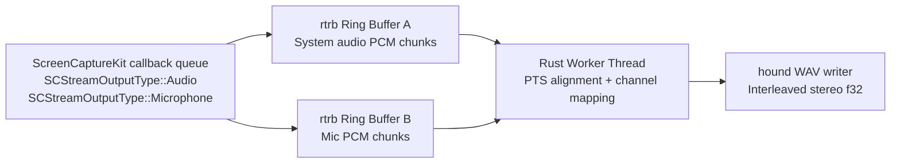

# Real-Time Architecture

## Threading Contract

Callback thread (high priority):
- Accept `CMSampleBuffer` from SCK.
- Convert/copy into preallocated chunk slots.
- Push into lock-free SPSC ring.
- No mutex, no heap growth, no disk I/O.

Worker thread (normal priority):
- Pop mic/system chunks.
- Align by PTS in one timeline.
- Downmix each source to mono.
- Interleave stereo (`L=mic`, `R=system`).
- Write WAV frames to disk.

## Buffer Data Contract

Per chunk:
- `kind`: `Audio` or `Microphone`
- `pts_seconds`: `CMSampleBuffer.presentation_timestamp()`
- `sample_rate_hz`
- `mono_samples: [f32; N]` (or fixed-capacity block + valid length)

## Interleave Rules

- Base timeline origin:
  - `base_pts = min(first_mic_pts, first_system_pts)`
- Placement:
  - `start_index = round((pts - base_pts) * sample_rate)`
- Stereo write:
  - frame `i`: `left = mic[i]`, `right = system[i]`

## Failure and Recovery

- If `SCStreamErrorSystemStoppedStream` occurs, restart stream and continue into new segment.
- Sample-rate mismatch policy is explicit:
  - `strict`: fail fast if mic/system rates do not both match the requested target rate.
  - `adapt-stream-rate` (default): keep requested target as canonical output rate and resample mismatched chunks in the worker path.
  - recorder telemetry includes a `sample_rate_policy` section with mode, input rates, and resample counters.

## Prototype in Repo

- Probe: `src/main.rs`
- WAV recorder: `src/bin/sequoia_capture.rs`
- Build/run orchestration: `Makefile`

## Execution Modes

- Debug recorder (`make capture` / `cargo run --bin sequoia_capture`):
  - writes output relative to current shell working directory
- Signed app bundle (`make run-app`):
  - runs sandboxed as bundle id `com.recordit.sequoiacapture`
  - relative output paths resolve under `~/Library/Containers/com.recordit.sequoiacapture/Data/`
- Test binary (`cargo test --bin sequoia_capture -- --nocapture`):
  - inherits `DYLD_LIBRARY_PATH=/usr/lib/swift` from `.cargo/config.toml`
  - avoids the `libswift_Concurrency.dylib` loader failure that occurs when the Swift runtime path is absent

## Transcribe Model Resolution

- `transcribe-live` resolves model assets with strict precedence:
  - `--asr-model <path>`
  - `RECORDIT_ASR_MODEL`
  - backend defaults
- Backend default lookup is context-aware:
  - sandbox app context root: `~/Library/Containers/com.recordit.sequoiatranscribe/Data/models`
  - debug/repo defaults: `artifacts/bench/models/**` then `models/**`
- Current backend defaults:
  - `whispercpp`: `whispercpp/ggml-tiny.en.bin` (file)
  - `whisperkit`: `whisperkit/models/argmaxinc/whisperkit-coreml/openai_whisper-tiny` (directory)
  - `moonshine`: `moonshine/base` (placeholder path contract)
- Type validation is backend-specific:
  - `whispercpp` must resolve to a file
  - `whisperkit` must resolve to a directory
- Preflight/runtime diagnostics include resolved path + source, and failures enumerate checked paths with remediation to set `--asr-model` or `RECORDIT_ASR_MODEL`.

## Test Runtime Path Contract

- ScreenCaptureKit-linked test binaries need the Swift runtime loader path at execution time.
- This repo encodes that path in `.cargo/config.toml`, so contributors and CI can use plain Cargo commands without a manual `export DYLD_LIBRARY_PATH=/usr/lib/swift`.
- Canonical test command:
  - `cargo test --bin sequoia_capture -- --nocapture`

## Current State (Implemented)

1. Capture transport (`bd-3ib`)
   - callback path uses preallocated fixed-capacity transport (`src/rt_transport.rs`)
   - pressure/drop counters are explicit (`slot_miss_drops`, `queue_full_drops`, `ready_depth_high_water`)
2. Transcribe runtime (`bd-1yz`, `bd-if5`, `bd-3oj`, `bd-2wu`, `bd-2p6`, `bd-3lv`)
   - deterministic dual-channel merge + replayable JSONL event stream
   - bounded asynchronous cleanup lane with non-blocking enqueue/drop policy
   - explicit mode degradation semantics + `llm_final` lineage
   - sandbox-aware model resolution precedence with actionable diagnostics
   - readable transcript defaults with deterministic overlap annotation policy
3. Gate evidence and policy docs
   - Gate A/B decision: `docs/adr-001-backend-decision.md`
   - Gate C stress + cleanup thresholds: `docs/gate-c-report.md`, `docs/cleanup-benchmark-report.md`

## Target State (Near-Term)

1. Promote telemetry and readability defaults into release gates
   - complete downstream blockers (`bd-7cb`, `bd-z21`, `bd-oe2`) once telemetry lane `bd-a88` lands
2. Finalize operator guardrails for long-session reliability
   - enforce soak/regression commands as required CI/manual gate inputs
3. Keep architecture/ADR set synchronized with implementation
   - update this doc and ADRs on each contract-level behavior change

## ADR Index

- `docs/adr-001-backend-decision.md`: backend selection + explicit fallback triggers
- `docs/adr-002-lock-free-transport.md`: callback transport decision and tradeoffs
- `docs/adr-003-cleanup-boundary-policy.md`: cleanup isolation boundary and auto-disable policy

## Evidence Index

- lock-free transport stress evidence:
  - `artifacts/validation/bd-27t.transport_stress.txt`
- Gate C dual/mixed stress evidence:
  - `artifacts/bench/gate_c/dual_t4_dyld/20260227T122726Z/summary.csv`
  - `artifacts/bench/gate_c/mixed_t4_dyld/20260227T122735Z/summary.csv`
- cleanup queue policy evidence:
  - `artifacts/bench/cleanup/20260227T124016Z/cleanup_summary.csv`
  - `artifacts/bench/cleanup/20260227T124016Z/threshold_policy.json`
  - `artifacts/bench/cleanup/20260227T124016Z/threshold_evaluation.csv`
