# Program State Machine

This document is the state-machine single source of truth for `recordit`.

It is intended to stay tighter than prose architecture docs and closer to the code than product notes. If runtime behavior changes, update this file in the same change as the implementation.

## Scope

This document covers the executable behavior of:

- `recordit` (canonical operator shell)
- `transcribe-live`
- shared live capture runtime
- shared live-stream runtime coordinator
- live ASR worker-pool queue policy

It does not try to model every internal helper function. It models the states, guards, transitions, and side effects that matter for operator-visible behavior and correctness.

## Normative Source Mapping

- Canonical operator CLI parsing, command mapping, and dispatch: [`src/recordit_cli.rs`](../src/recordit_cli.rs)
- Legacy runtime CLI parsing and branch selection: [`src/bin/transcribe_live/app.rs`](../src/bin/transcribe_live/app.rs)
- Legacy `transcribe-live` compatibility shell: [`src/bin/transcribe_live.rs`](../src/bin/transcribe_live.rs)
- Shared capture runtime: [`src/live_capture.rs`](../src/live_capture.rs)
- Shared live-stream coordinator and streaming VAD scheduler: [`src/live_stream_runtime.rs`](../src/live_stream_runtime.rs)
- Live ASR worker pool and bounded queue policy: [`src/live_asr_pool.rs`](../src/live_asr_pool.rs)
- Callback transport contract: [`src/rt_transport.rs`](../src/rt_transport.rs)
- Real-time contract and recovery matrix: [`docs/realtime-contracts.md`](./realtime-contracts.md)
- SwiftUI↔Rust ownership boundary contract: [`docs/runtime-boundary-ownership-contract.md`](./runtime-boundary-ownership-contract.md)

## Global Invariants

These invariants apply across all diagrams below.

1. ScreenCaptureKit callback work is non-blocking.
2. Bounded queues drop or evict work under pressure instead of stalling producers.
3. Runtime artifacts are authoritative:
   - JSONL is append-only runtime evidence
   - manifest is the deterministic session summary
4. `--live-stream` and `--live-chunked` are mutually exclusive.
5. `--preflight` and `--replay-jsonl` are diagnostics/replay entrypoints, not runtime modes.
6. Packaged and debug entrypoints should preserve the same runtime semantics.
7. The canonical operator path is `recordit`; direct `transcribe-live` remains additive for legacy automation, gates, and expert workflows.
8. Operator-first terminal surfaces are concise but traceable:
   - startup banner first
   - explicit `run_status`
   - explicit `remediation_hints`
   - artifacts remain the deeper source of truth

## 1. Top-Level CLI State Machine

Source of truth:

- `recordit_cli::main()`
- `parse_command(...)`
- `map_run_command(...)`
- `map_doctor_command(...)`
- `map_preflight_command(...)`
- `dispatch_transcribe_live(...)`
- `transcribe_live::run_with_args_in_operator_mode(...)`

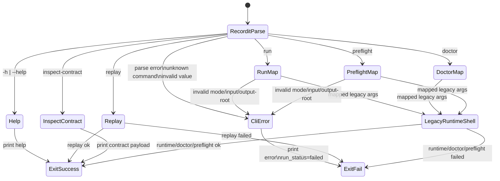

### CLI Guard Rules

These canonical operator-shell guards are enforced before legacy runtime execution starts.

| Guard | Result |
|---|---|
| `recordit run` without `--mode <live\|offline>` | reject config |
| `recordit run --mode live` with `--input-wav` | reject config |
| `recordit run --mode offline` without `--input-wav` | reject config |
| `recordit preflight --mode live` with `--input-wav` | reject config |
| replay without `--jsonl <path>` | reject config |

Legacy `transcribe-live` guards still apply after mapping and remain the source of truth for:

- `--live-stream && --live-chunked`
- live selectors combined with `--replay-jsonl`
- `--model-doctor` combined with `--preflight`
- chunk tuning flags without a live mode
- `--llm-cleanup` without endpoint/model

## 2. Runtime Branch State Machine

Source of truth:

- `select_runtime_execution_branch(...)`
- `run_representative_offline_pipeline(...)`
- `run_representative_chunked_pipeline(...)`
- `run_live_stream_pipeline(...)`

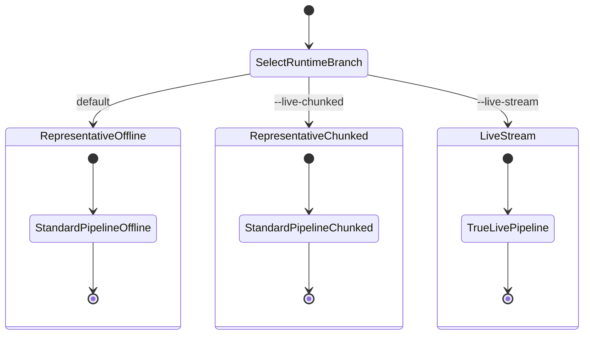

### Branch Semantics

| Branch | Input WAV semantics | Output WAV semantics | Capture behavior |
|---|---|---|---|
| `representative-offline` | pre-existing or synthesized fixture | canonical output artifact | no live capture |
| `representative-chunked` | scratch artifact mirrored from capture | canonical session artifact | capture first, then near-live scheduling over WAV |
| `live-stream` | progressive scratch WAV growing during runtime | canonical session artifact materialized on successful closeout | capture and transcription run concurrently |

## 3. Representative Pipeline Lifecycle

This models `run_standard_pipeline(...)`, which is used by:

- representative offline
- representative chunked

Source of truth:

- `run_standard_pipeline(...)`

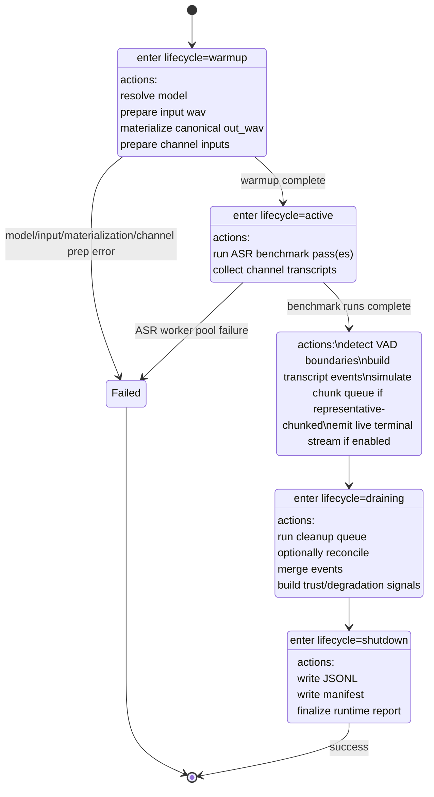

### Representative Pipeline Notes

- In `representative-offline`, transcript events are synthesized from complete transcript text plus VAD boundaries.
- In `representative-chunked`, the chunk queue simulation can emit:
  - `partial`
  - `final`
  - `reconciled_final`
- Cleanup is additive only; it never blocks the core transcript path.

## 4. Shared Capture Runtime State Machine

This models the shared live capture engine used by:

- `sequoia_capture`
- `transcribe-live --live-chunked`
- `transcribe-live --live-stream`

Source of truth:

- `run_capture_session(...)`
- `run_streaming_capture_session(...)`
- `run_fake_capture_session(...)`

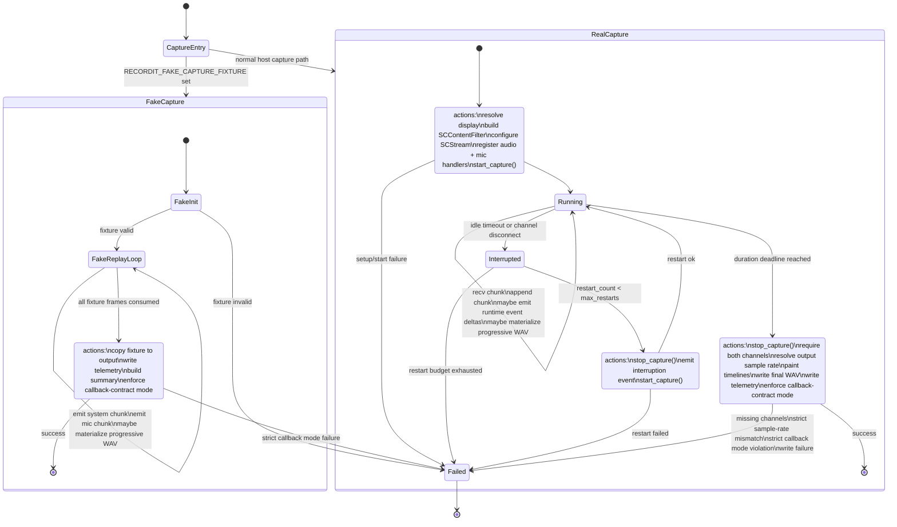

### Capture Runtime Guards

| Condition | Behavior |
|---|---|
| missing display | fail before capture starts |
| no mic chunks or no system chunks at finalize | fail |
| strict sample-rate mismatch | fail |
| adapt-stream-rate mismatch | resample in worker path |
| callback violations in `warn` mode | emit telemetry and continue |
| callback violations in `strict` mode | fail after capture completes |

### Capture Runtime Side Effects

- Progressive scratch WAV may be materialized during active capture.
- Final capture telemetry is always written next to the output WAV.
- Degradation is turned into explicit events instead of silent recovery.

## 5. Live-Stream Runtime State Machine

This models the true concurrent live runtime in `run_live_stream_pipeline(...)`.

Source of truth:

- `run_live_stream_pipeline(...)`
- `LiveStreamRuntimeExecution`

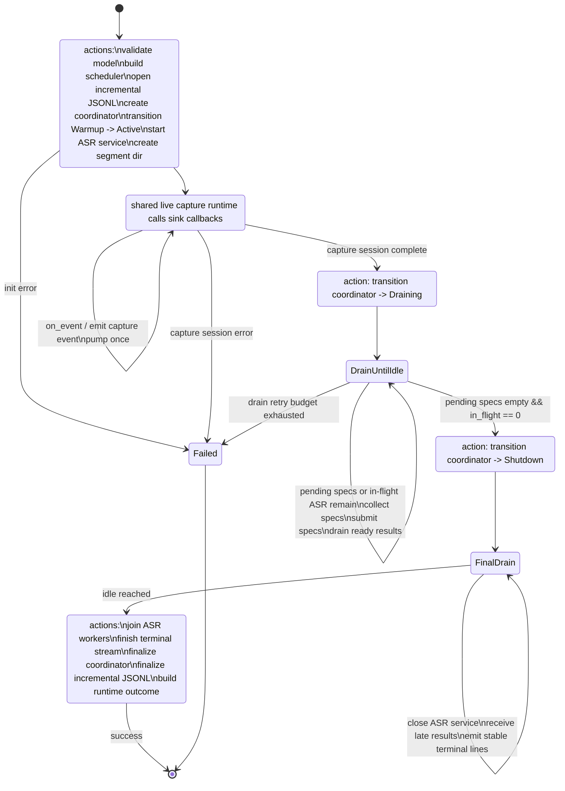

### Live-Stream Pump Cycle

Each `pump_once()` call performs the same micro-state sequence:

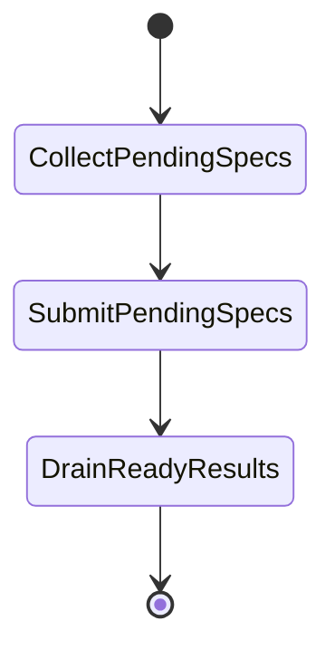

### Live-Stream Runtime Notes

- `ready_for_transcripts=false` only in `Warmup`.
- terminal partial lines only render in interactive TTY mode
- stable lines can render during runtime in active mode
- incremental JSONL is written during runtime, not just at shutdown

## 6. Live Coordinator Lifecycle State Machine

This is the internal coordinator state machine used by the true live-stream path.

Source of truth:

- `LiveStreamCoordinator`
- `LiveRuntimePhase`

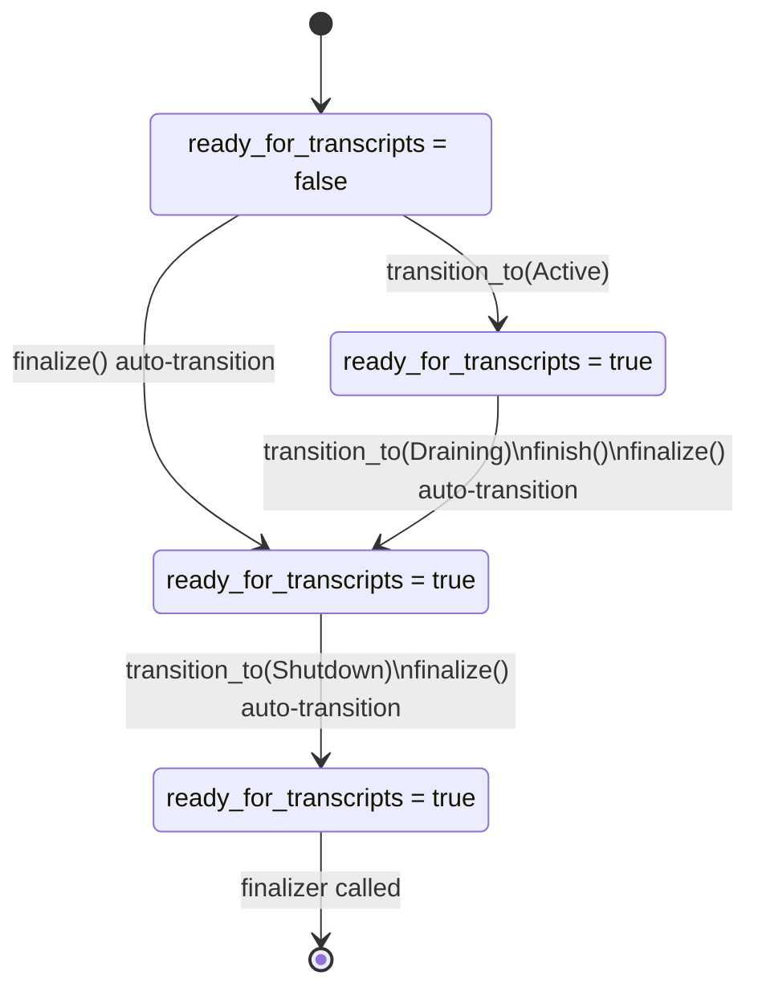

### Coordinator Transition Semantics

On every explicit phase transition:

1. `current_phase` updates
2. lifecycle event is emitted
3. scheduler `on_phase_change(...)` runs
4. any jobs emitted by the scheduler are queued

If `finalize()` is called before shutdown:

- `Warmup` or `Active` auto-transition to `Draining`
- then auto-transition to `Shutdown`
- any leftover pending jobs are counted as abandoned

## 7. Streaming VAD Scheduler State Machine

This is the state machine that turns incoming capture chunks into live ASR job specs.

Source of truth:

- `StreamingVadTracker`
- `StreamingVadScheduler`

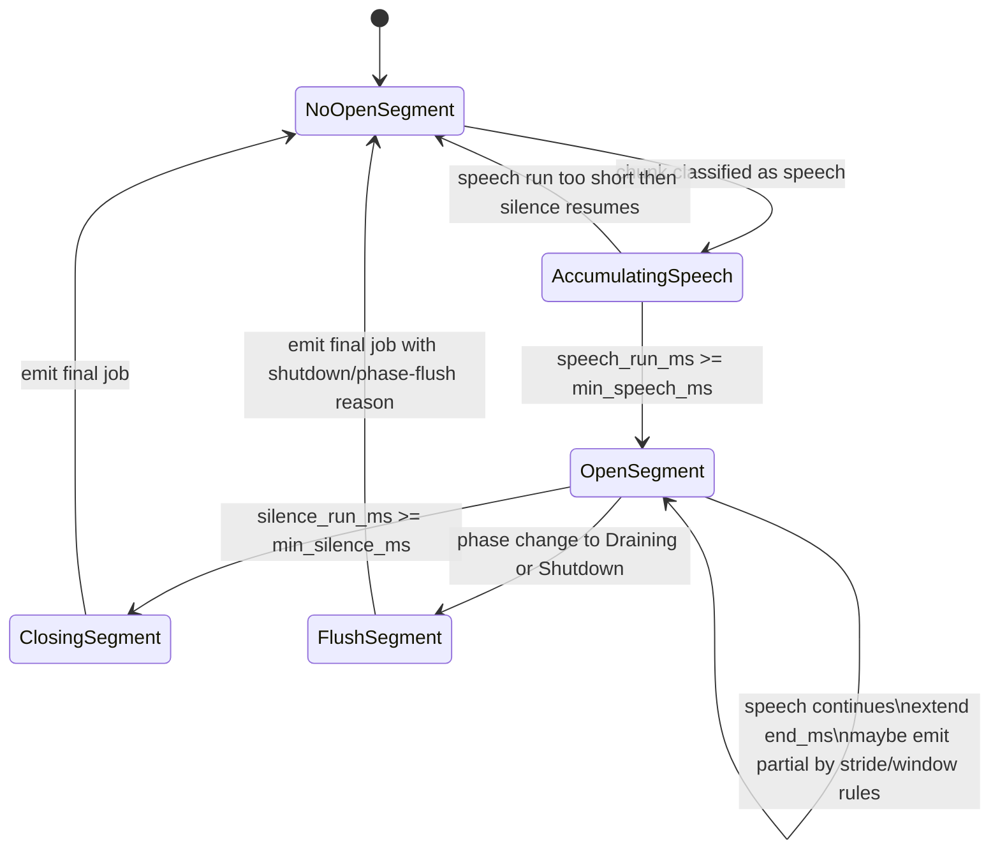

### VAD Scheduler Guard Rules

| Condition | Effect |
|---|---|
| phase = `Warmup` | boundary tracking continues, but no jobs are emitted |
| phase = `Active` | partial and final jobs may be emitted |
| phase = `Draining` or `Shutdown` | open segments are flushed into final jobs |
| phase = `Shutdown` on `on_capture(...)` | no new jobs emitted |

## 8. Live ASR Queue Admission State Machine

This models `LiveAsrService::submit(...)` plus the queue policy.

Source of truth:

- `LiveAsrService::submit(...)`
- `ServiceQueueState::enqueue_with_policy(...)`

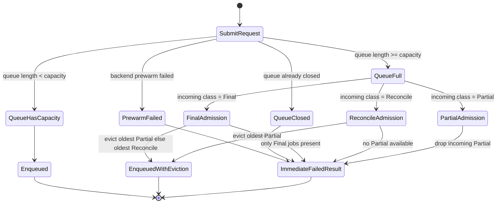

### Worker Consumption Order

Once jobs are admitted, workers consume in this order:

1. `Final`
2. `Reconcile`
3. `Partial`

That priority is strict.

## 9. ASR Worker Execution State Machine

Source of truth:

- worker loop inside `LiveAsrService::start(...)`
- `finalize_temp_audio_path(...)`

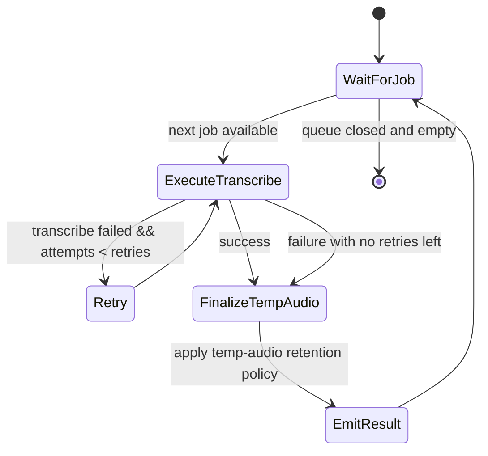

### Temp Audio Policy Outcomes

| Policy | Success | Failure |
|---|---|---|
| `DeleteAlways` | delete | delete |
| `RetainOnFailure` | delete | retain |
| `RetainAlways` | retain | retain |

## 10. Recovery and Degradation State Machine

This is the operator-visible degradation path shared across representative-chunked and live-stream reporting.

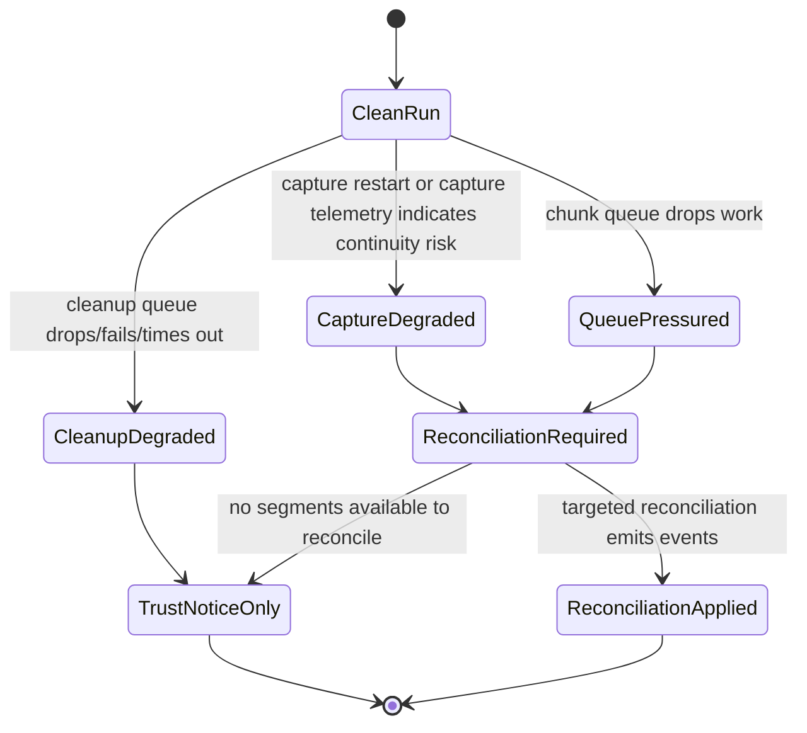

### Canonical Degradation Codes

- `live_capture_interruption_recovered`
- `live_capture_continuity_unverified`
- `live_capture_transport_degraded`
- `live_capture_callback_contract_degraded`
- `live_chunk_queue_drop_oldest`
- `live_chunk_queue_backpressure_severe`
- `reconciliation_applied_after_backpressure`

## 11. What Each Lifecycle Phase Means

| Phase | Meaning | Transcript readiness |
|---|---|---|
| `warmup` | preparing model, capture, routing, runtime surfaces | not ready |
| `active` | live transcript production may emit partial/final events | ready |
| `draining` | no new active capture expected; finishing queued ASR/cleanup/reconciliation | ready |
| `shutdown` | runtime execution complete; final artifact closeout | ready |

## 12. Update Policy

When implementation changes affect any of the following, update this document:

- top-level CLI mode routing
- lifecycle phase definitions
- capture interruption/restart behavior
- queue priority or eviction rules
- reconciliation trigger rules
- artifact timing or truth semantics

If a change cannot be expressed by these diagrams anymore, treat that as a design smell and either:

1. simplify the implementation, or
2. split the state machine into clearer submachines here before shipping the behavior change
