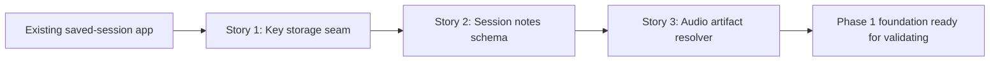

# Story Map: Phase 1 - Secure Notes Foundation

## Dependency Diagram

## Story Table

| Story | What Happens | Why Now | Contributes To | Creates | Unlocks | Done Looks Like |
|---|---|---|---|---|---|---|
| Story 1: Key storage seam | Add a protocol-backed Gemini API-key store with Keychain implementation and tests. | Secure secret storage must exist before upload or UI work. | D1, D4, D9 | `GeminiAPIKeyStore`-style service and focused tests | Notes generation services can request a key safely. | Missing/save/update/delete behavior is tested without storing keys in session files. |
| Story 2: Session notes schema | Add generated-notes models and repository APIs for permanent success-only persistence. | D2, D5, D6, and D8 require a durable result shape and rollback behavior. | D2, D5, D6, D8 | Generated notes JSON/schema, repository read/write methods, tests | Gemini client can persist parsed results without touching bundle internals. | Old sessions load with no notes, saved notes reopen, transcript is persisted but not treated as visible UI data, failed writes preserve prior files. |
| Story 3: Audio artifact resolver | Add repository/service API that returns both manifest-backed audio artifacts for a selected session. | D3 requires both saved source artifacts, and Phase 2 should not hardcode filenames. | D3, D8 | Audio artifact read model, missing-file error, tests | Gemini Files API upload can consume exact URLs and MIME candidates. | Resolver returns both sources for M4A and WAV cases and fails clearly when required artifacts are missing. |

## Order Check

- [x] Story 1 is obviously first because API-key storage is a prerequisite for any Gemini-enabled v1.
- [x] Story 2 builds the durable result boundary before any service tries to save generated output.
- [x] Story 3 exposes audio inputs after the repository result boundary is clear, keeping bundle ownership in one place.
- [x] If all stories finish, the Phase 1 exit state holds.

## Story-To-Bead Mapping

| Story | Beads | Notes |
|---|---|---|
| Story 1: Key storage seam | `bd-2u9` | Owns key-store service files and key-store tests only. |
| Story 2: Session notes schema | `bd-2yy` | Owns session repository generated-notes models/APIs and repository tests. Depends on `bd-2u9`. |
| Story 3: Audio artifact resolver | `bd-2k0` | Owns session repository audio artifact read model/API and resolver tests. Depends on `bd-2yy`. |
