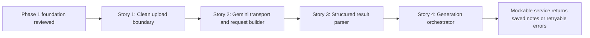

# Story Map: Phase 2 - Gemini Upload And Structured Result

## Dependency Diagram

## Story Table

| Story | What Happens | Why Now | Contributes To | Creates | Unlocks | Done Looks Like |
|---|---|---|---|---|---|---|
| Story 1 | Repository returns only session-owned audio artifact facts. | It closes the Phase 1 review follow-up before new consumers depend on the old DTO. | Clean architecture boundary. | Narrow artifact DTO plus tests. | Gemini request builder. | `bd-227` acceptance criteria pass. |
| Story 2 | Gemini client uploads both audio files and sends a structured generate request via injectable transport. | The provider contract should be fixture-proven before orchestration. | Real Gemini integration seam. | Client, request/response DTOs, mock transport fixtures. | Parser and orchestrator tests. | Upload and generate request tests pass without network. |
| Story 3 | Structured output is decoded and validated into `GeneratedSessionNotes`. | Persistence must not save partial or unusable model output. | Stable generated-notes data contract. | Parser, schema constants, validation errors. | Safe save orchestration. | Valid and invalid fixture tests pass. |
| Story 4 | A high-level service loads the API key, resolves audio, calls Gemini, and saves notes only after full success. | Phase 3 needs one app-facing operation. | Phase 2 exit state. | `GeminiSessionNotesGenerating` implementation and tests. | Session Detail UI generation flow. | Success persists notes; failures leave bundle unchanged. |

## Order Check

- [x] Story 1 is obviously first because it removes the known review boundary issue.
- [x] Later stories build on the clean artifact contract and provider request seam.
- [x] If all stories finish, the phase exit state holds.

## Story-To-Bead Mapping

| Story | Beads | Notes |
|---|---|---|
| Story 1 | `bd-227` | Existing review bead; must close before request-builder work spreads the DTO. |
| Story 2 | `bd-g06` | Gemini transport/request builder; depends on `bd-227`. |
| Story 3 | `bd-sbt` | Structured parser/schema validation; depends on `bd-g06`. |
| Story 4 | `bd-3ra` | Service orchestration and non-mutating persistence tests; depends on `bd-g06` and `bd-sbt`. |
