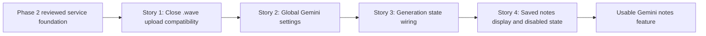

# Story Map: Phase 3 - Session Detail Experience

## Dependency Diagram

## Story Table

| Story | What Happens | Why Now | Contributes To | Creates | Unlocks | Done Looks Like |
|---|---|---|---|---|---|---|
| Story 1 | Repository-valid `.wave` files map to `audio/wav` in Gemini upload requests. | Prevents a known service mismatch from surfacing in the visible Generate flow. | Reliable generation for valid saved audio. | Mapper fix and request-builder test. | Settings/UI work can assume the service boundary is consistent. | `.wave` request uses `audio/wav`; existing `.m4a`/`.wav` behavior remains. |
| Story 2 | Add global Gemini settings route and key-management state. | D4 must be true before users can generate. | Key configured state and missing-key messaging. | Settings view/model or equivalent app-shell state. | Session Detail can enable/disable Generate based on key availability. | User can save/update/delete key; secret is not displayed in full. |
| Story 3 | Add Session Detail Generate lifecycle with confirmation, progress, and retryable errors. | D8/D9 are the critical trust controls for upload. | Safe external upload action. | View-model generation state, AppModel orchestration call, confirmation alert. | Notes panel can refresh on success. | Cancel does nothing; confirm starts; failures leave session unchanged and retryable. |
| Story 4 | Show persisted Summary and Action Items and disable Generate after success. | This completes the v1 user value. | Final visible result. | Notes panel, action-item list, reopened-detail state. | Review/closeout. | Reopen shows saved notes; hidden transcript is not visible; Generate cannot overwrite. |

## Order Check

- [x] Story 1 is obviously first because it removes a known service mismatch before exposing the UI.
- [x] Story 2 comes before generation because the key is global and required.
- [x] Story 3 comes before display polish because it creates the success/failure lifecycle.
- [x] Story 4 closes the phase by showing the persisted result and disabled state.
- [x] If all stories finish, the phase exit state holds.

## Story-To-Bead Mapping

| Story | Beads | Notes |
|---|---|---|
| Story 1 | `bd-1on` | Existing Phase 2 review follow-up; keep as first Phase 3 dependency. |
| Story 2 | `bd-1ok` | Global shell/settings and Keychain UI state; depends on `bd-1on`. |
| Story 3 | `bd-uen` | AppModel + Session Detail generation lifecycle; depends on `bd-1ok`. |
| Story 4 | `bd-213` | Persisted notes display and final disabled state; depends on `bd-uen`. |
