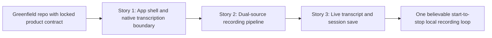

# Phase Contract: Phase 1 - First Live Recording Loop

**Date**: 2026-04-22
**Feature**: `native-macos-meeting-recorder`
**Phase Plan Reference**: `history/native-macos-meeting-recorder/phase-plan.md`
**Based on**:
- `history/native-macos-meeting-recorder/CONTEXT.md`
- `history/native-macos-meeting-recorder/discovery.md`
- `history/native-macos-meeting-recorder/approach.md`

---

## 1. What This Phase Changes

This phase makes the product real for the first time. A user can open the brand-new macOS app, start one local recording session, let whole-system meeting audio and microphone input flow through separate source paths, watch `Meeting` and `Me` transcript chunks appear live, and stop the session with a saved local session bundle left on disk. After this lands, the app is no longer just a shell or a plan; it can complete one end-to-end loop that proves the hardest technical promise in the feature.

---

## 2. Why This Phase Exists Now

- This phase is first because every later screen depends on real session artifacts, not placeholder data.
- If this phase were skipped, history, detail, delete, and incomplete-session work would be designed against guesses instead of a proven capture and persistence shape.
- It also forces the riskiest seams into the open immediately: ScreenCaptureKit dual-source capture, `whisper.cpp` loading, live transcript coordination, and local session durability.

---

## 3. Entry State

- The repo contains Khuym workflow state and planning artifacts, but no app target, no Swift code, and no existing recorder implementation.
- The feature contract is locked in `history/native-macos-meeting-recorder/CONTEXT.md`, including separate `Meeting` and `Me` transcript labels and local-only persistence.
- Discovery and approach work already established the intended stack: Swift, SwiftUI, ScreenCaptureKit, and a pinned `whisper.cpp` bridge isolated from the main app target.

---

## 4. Exit State

- A new native macOS app project exists and launches into a simple recording-first home flow with Start/Stop controls.
- Pressing Record can begin one real session that captures whole-system audio plus microphone input as separate source pipelines, or clearly blocks on missing permissions with a focused repair path that deep-links to System Settings and explains any relaunch requirement.
- During recording, the app shows committed live transcript chunks labeled `Meeting` and `Me` from local transcription workers.
- Pressing Stop leaves behind a self-contained local session bundle containing session metadata, a timestamp-based default title, the exact live transcript snapshot, and one durable audio file per source.
- If the recording ends unexpectedly after the session starts, enough metadata, transcript state, and surviving source data are persisted for the session to be treated as incomplete rather than lost.

**Rule:** every exit-state line must be testable or demonstrable.

---

## 5. Demo Walkthrough

A user launches the app on an Apple Silicon Mac, presses Record, repairs any missing permissions if required, then speaks into the microphone while meeting audio plays through the system. The app shows labeled `Meeting` and `Me` chunks with a short live delay, continues if one source degrades, and when the user presses Stop it writes a session folder containing the expected audio and transcript artifacts.

### Demo Checklist

- [ ] Launch the app and reach a minimal home screen with a clear record action.
- [ ] Start one recording session with separate system-audio and microphone capture paths active, or see a repair path that opens the right System Settings destination.
- [ ] Observe live `Meeting` and `Me` transcript chunks while audio is flowing.
- [ ] Stop the session and verify a saved local session bundle contains metadata, a timestamp-based default title, the transcript snapshot, and per-source audio files.

---

## 6. Story Sequence At A Glance

| Story | What Happens | Why Now | Unlocks Next | Done Looks Like |
|-------|--------------|---------|--------------|-----------------|
| Story 1: App shell and native transcription boundary | The app exists as a launchable macOS target and can load the bundled local transcription engine behind a stable Swift-facing boundary | We need a running product shell and a proven `whisper.cpp` integration seam before capture work can depend on it | A real recording coordinator can call into a supported transcription worker instead of a speculative bridge | The app boots, the model loads through the wrapper, and a small in-app transcription smoke path succeeds |
| Story 2: Dual-source recording pipeline | One recording session can start ScreenCaptureKit capture, keep system audio and microphone distinct, normalize them into transcription/file-writing inputs, and surface source health | Capture shape must exist before transcript UI or saved session logic can be trusted | Live transcript coordination and durable session persistence can attach to real source streams | A recording session yields active `Meeting` and `Me` pipelines with explicit degraded-state reporting |
| Story 3: Live transcript and session save | The two source pipelines feed committed live transcript chunks into the UI and save a usable session bundle on stop or interruption | This story closes the loop the user actually cares about | Phase 2 can build history and session detail from real saved sessions | A start-to-stop recording produces live labeled transcript and a reopenable local session bundle |

---

## 7. Phase Diagram

---

## 8. Out Of Scope

- History browsing, session detail navigation, delete actions, and browse-only list polish stay in Phase 2.
- Final post-recording retranscription, export/share flows, playback UI, search/filtering, and per-app capture targeting remain out of scope for this phase.
- Core ML acceleration, advanced packaging polish, and deep Apple-Silicon performance tuning remain Phase 3 hardening work unless validating proves a blocker.

---

## 9. Success Signals

- A reviewer can run one end-to-end recording and watch distinct `Meeting` and `Me` chunks appear without relying on cloud services.
- The saved session bundle structure is concrete enough that later history/detail work can read it directly instead of redefining it, including the default title and incomplete-session status.
- The phase exposes the real latency, memory, permission, and durability behavior of the chosen stack on a target Mac.

---

## 10. Failure / Pivot Signals

- ScreenCaptureKit cannot reliably provide the separate system-audio and microphone paths required for `Meeting` vs `Me` on the planned target setup.
- The chosen bundled model plus dual `whisper` workers cannot maintain believable live responsiveness on Apple Silicon without a design change.
- Session durability proves too fragile to preserve incomplete recordings safely with the current bundle layout and snapshot strategy.
- The `whisper.cpp` wrapper cannot be packaged cleanly enough to keep native build complexity out of the main app target.
