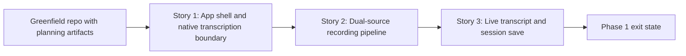

# Story Map: Phase 1 - First Live Recording Loop

**Date**: 2026-04-22
**Phase Plan**: `history/native-macos-meeting-recorder/phase-plan.md`
**Phase Contract**: `history/native-macos-meeting-recorder/phase-1-contract.md`
**Approach Reference**: `history/native-macos-meeting-recorder/approach.md`

---

## 1. Story Dependency Diagram

---

## 2. Story Table

| Story | What Happens In This Story | Why Now | Contributes To | Creates | Unlocks | Done Looks Like |
|-------|-----------------------------|---------|----------------|---------|---------|-----------------|
| Story 1: App shell and native transcription boundary | The repo gains a launchable native app shell and a stable Swift-facing `whisper.cpp` integration seam that can perform a local smoke transcription | The app and transcription boundary must be real before capture and session logic can be wired into them | Exit-state lines 1 and 3, plus locked decisions `D6`, `D14`, and `D17` | App target, home screen skeleton, transcription wrapper, source-worker contract | Story 2 can build recording around a proven shell and transcription API | The app boots, Start/Stop UI exists, and a bundled-model transcription smoke path succeeds inside the app environment |
| Story 2: Dual-source recording pipeline | A recording coordinator can start ScreenCaptureKit capture, keep meeting audio and microphone separate, normalize both streams, and track degraded source health | Capture shape is the prerequisite for meaningful transcript and save behavior | Exit-state lines 2 and 5, plus locked decisions `D1`, `D15`, `D16`, `D20`, and `D21` | Recording coordinator, source pipelines, file-writer path, source-health model | Story 3 can attach live transcript merging and save behavior to real source streams | One session can start and maintain distinct `Meeting` and `Me` pipelines with explicit health state and focused permission repair |
| Story 3: Live transcript and session save | The running source pipelines emit committed live transcript chunks to the UI and persist a session bundle on stop or interruption | This closes the loop and proves the product promise instead of isolated subsystems | Exit-state lines 3, 4, and 5, plus locked decisions `D2`, `D5`, `D7`, `D11`, `D12`, and `D23` | Transcript timeline, session repository, interruption save behavior, saved bundle contract | Phase 2 can build browse/open/delete flows over real saved sessions | A finished or interrupted recording leaves behind transcript and audio artifacts that can be inspected on disk |

---

## 3. Story Details

### Story 1: App shell and native transcription boundary

- **What Happens In This Story**: the repo gets its first macOS app scaffold, a recording-first home screen, and an isolated `whisper.cpp` bridge that can load the bundled model and produce a local smoke transcription.
- **Why Now**: without a launchable shell and proven native bridge, later stories would be building capture and persistence on top of an unverified dependency seam.
- **Contributes To**: the app target existing and the live transcript stack having a trustworthy local transcription foundation.
- **Creates**: project structure, initial app navigation, wrapper target/package boundary, source-worker API contract, and model-loading lifecycle.
- **Unlocks**: recording coordination and source pipeline work that can depend on a real transcription API.
- **Done Looks Like**: the app launches, the home screen exposes the recording entry point, and a bundled local model can be loaded and exercised through the Swift bridge.
- **Candidate Bead Themes**:
  - app project scaffold and recording-first shell
  - vendor wrapper and local transcription worker proof

### Story 2: Dual-source recording pipeline

- **What Happens In This Story**: the app can begin one session, receive separate whole-system audio and microphone buffers, normalize them into a shared internal shape, and keep per-source health visible while handling permission repair through System Settings deep links when access is missing.
- **Why Now**: this is the hardest runtime seam after the transcription boundary, and later transcript/save behavior only matters if the source paths are real.
- **Contributes To**: the ability to start recording, maintain two labeled sources, block cleanly on missing permissions, and degrade honestly if one source fails.
- **Creates**: recording coordinator, ScreenCaptureKit service, per-source normalization pipeline, audio file writing hooks, and degraded-state model.
- **Unlocks**: live transcript coordination and durable session persistence against real runtime data.
- **Done Looks Like**: a session starts and maintains separate `Meeting` and `Me` streams, with source failures surfaced without dropping the entire session.
- **Candidate Bead Themes**:
  - ScreenCaptureKit session orchestration and permission gate
  - source normalization, per-source file writing, and degraded-state handling

### Story 3: Live transcript and session save

- **What Happens In This Story**: both source pipelines feed committed transcript chunks into the recording UI and leave behind a self-contained session bundle when the session stops or is interrupted, without any post-recording retranscription pass.
- **Why Now**: this story closes the phase by turning the capture and transcription subsystems into a product result the user can trust.
- **Contributes To**: live labeled transcript output, durable session artifacts, timestamp-based session metadata, and incomplete-session preservation.
- **Creates**: transcript coordinator, view-model updates, manifest/transcript snapshot files, and interruption-safe session finalization.
- **Unlocks**: Phase 2 history/detail/delete work built on real saved sessions.
- **Done Looks Like**: a start-to-stop or interrupted session produces visible transcript output during recording and durable local artifacts after recording.
- **Candidate Bead Themes**:
  - transcript merge and recording UI updates
  - session repository, manifest snapshot, and interruption recovery

---

## 4. Story Order Check

- [x] Story 1 is obviously first
- [x] Every later story builds on or de-risks an earlier story
- [x] If every story reaches "Done Looks Like", the phase exit state should be true

---

## 5. Decision Coverage

| Locked Decision | Why It Matters In Phase 1 | Story | Bead |
|----------------|----------------------------|-------|------|
| `D1` | System audio and microphone must stay separate from the start | Story 2 | `bd-303`, `bd-2az` |
| `D2` | Live transcript must label chunks as `Meeting` and `Me` | Story 3 | `bd-2rx` |
| `D5` | Interrupted recordings must persist as incomplete instead of disappearing | Story 3 | `bd-p23` |
| `D6` | First launch stays minimal and only asks permissions when needed | Story 1 / Story 2 | `bd-3uo`, `bd-303` |
| `D7` | Saved sessions need a timestamp-based default title | Story 3 | `bd-p23` |
| `D11` | Raw per-source audio is the durable source of record | Story 2 / Story 3 | `bd-2az`, `bd-p23` |
| `D12` | Phase 1 must not add a final post-recording transcription pass | Story 3 | `bd-2rx`, `bd-p23` |
| `D14` | Recording controls stay a simple Start/Stop flow | Story 1 | `bd-3uo` |
| `D15` | If one source fails, recording continues with the surviving source and a warning | Story 2 | `bd-2az` |
| `D16` | Recording scope is whole-system audio plus microphone, not per-app targeting | Story 2 | `bd-303` |
| `D17` | Home emphasizes the record action with minimal surrounding content | Story 1 | `bd-3uo` |
| `D20` | Missing permissions block recording and trigger repair flow | Story 2 | `bd-303` |
| `D21` | Repair flow should deep-link to System Settings with short guidance | Story 2 | `bd-303` |
| `D23` | The saved transcript is the exact live snapshot seen during recording | Story 3 | `bd-2rx`, `bd-p23` |

---

## 6. Spike-Validated Constraints

- `bd-2o8` validated that Phase 1 can stay on one `ScreenCaptureKit` session for system audio plus microphone on the `macOS 15+` baseline, with permission repair and relaunch guidance handled in-app.
- `bd-2ne` validated that the transcription boundary should keep one isolated whisper context per source and should not share mutable context state across `Meeting` and `Me`.
- `bd-2gx` validated that the wrapper boundary should stay `XCFramework`-based and isolated from the main app target rather than pushing vendor build flags through the app project.
- `bd-1yz` validated that session durability should snapshot committed transcript state incrementally and persist enough metadata early that interrupted sessions survive as incomplete.

---

## 7. Story-To-Bead Mapping

> Fill this in after bead creation so validating and swarming can see how the narrative maps to executable work.

| Story | Beads | Notes |
|-------|-------|-------|
| Story 1: App shell and native transcription boundary | `bd-3uo`, `bd-2lw` | `bd-3uo` creates the launchable shell first; `bd-2lw` depends on it and proves the isolated `whisper.cpp` seam inside the app environment |
| Story 2: Dual-source recording pipeline | `bd-303`, `bd-2az` | `bd-303` establishes permission and capture orchestration; `bd-2az` depends on it to turn raw source callbacks into durable per-source pipelines |
| Story 3: Live transcript and session save | `bd-2rx`, `bd-p23` | `bd-2rx` depends on the source pipeline to surface live labeled transcript; `bd-p23` depends on both source durability and transcript shape so the saved bundle matches what the user saw |
