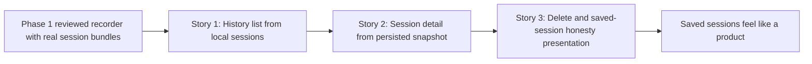

# Phase Contract: Phase 2 - Saved Sessions Feel Like a Product

**Date**: 2026-04-22
**Feature**: `native-macos-meeting-recorder`
**Phase Plan Reference**: `history/native-macos-meeting-recorder/phase-plan.md`
**Based on**:
- `history/native-macos-meeting-recorder/CONTEXT.md`
- `history/native-macos-meeting-recorder/discovery.md`
- `history/native-macos-meeting-recorder/approach.md`

---

## 1. What This Phase Changes

This phase makes the app useful after the meeting ends. A user can reopen Meetless, see their saved sessions in a simple history list, open any one of them into a read-only transcript-plus-metadata view, and delete sessions they no longer want. After this lands, the product is no longer only a recorder with files on disk; it becomes a saved-session app that lets the user live with those recordings.

---

## 2. Why This Phase Exists Now

- Phase 1 already proved that the app can save real session bundles locally.
- The next meaningful product slice is to turn those bundles into the browse/open/delete experience the user originally asked for.
- This phase stays intentionally focused on saved-session usability, not new capture architecture or late hardening work.

---

## 3. Entry State

- The app builds and can complete a real Phase 1 recording loop.
- Session bundles already exist on disk with `session.json`, `transcript.json`, `meeting.wav`, and `me.wav`.
- `AppModel` already owns the top-level app shell, but it does not yet track a selected saved session.
- `SessionRepository` already owns write-side persistence, but it does not yet expose read/list/load/delete APIs.
- History and detail screens are still placeholders.
- Review follow-ups `bd-2ap` and `bd-15x` are still open. They will later enrich saved-session warning fidelity, but they do not change the basic saved-session browse/open/delete loop Phase 2 is validating now.

---

## 4. Exit State

- Relaunching the app shows saved sessions in a browse-only history list built from the real local session bundles.
- Each history row shows the locked row contract: title, date/time, duration, and transcript preview.
- Incomplete sessions are visibly marked instead of blending in as if they were fully clean captures.
- Opening a saved session shows the persisted transcript snapshot plus saved metadata in a read-only detail screen, with no playback or editing controls.
- Deleting a saved session removes it from local storage and refreshes the history/detail state without leaving stale navigation behind.
- The Phase 2 UI has an explicit saved-session warning presentation surface and does not invent false certainty when enhanced honesty markers are absent.

**Rule:** every exit-state line must be testable or demonstrable.

---

## 5. Demo Walkthrough

A user records one normal session and one interrupted session, quits the app, and reopens it later. The history list shows both sessions with the right browseable row fields and incomplete-state presentation. The user opens each session into a transcript-plus-metadata detail view, then deletes one session and sees it disappear from both the list and local storage while the remaining session still opens correctly.

### Demo Checklist

- [ ] Relaunch the app and see one or more real saved sessions in history.
- [ ] Confirm the history rows show title, date/time, duration, and transcript preview.
- [ ] Confirm incomplete sessions are visibly marked.
- [ ] Open a saved session into a read-only detail screen that renders the persisted transcript snapshot and metadata.
- [ ] Delete a saved session and verify the local bundle is removed and the UI refreshes cleanly.

---

## 6. Story Sequence At A Glance

| Story | What Happens | Why Now | Unlocks Next | Done Looks Like |
|-------|--------------|---------|--------------|-----------------|
| Story 1: History list from local sessions | The app can discover saved local bundles and render them as browseable session rows | The user cannot benefit from saved recordings until they can see them again after recording ends | Real selection and detail loading over a trusted saved-session list | Relaunching the app shows actual saved sessions in history |
| Story 2: Session detail from persisted snapshot | Opening a saved session shows the transcript snapshot and metadata that were saved during recording | The saved-session product promise is not complete with a list alone | Delete and saved-session honesty work can build on one selected-session model | Selecting a session opens a read-only transcript-plus-metadata detail screen |
| Story 3: Delete and saved-session honesty presentation | Sessions can be deleted locally, incomplete state stays visible, and the saved-session UI gains a concrete warning surface for honest status messaging | This closes the saved-session loop so the app feels intentional rather than like raw file browsing | Phase 3 hardening can focus on trust and release quality, not missing product surfaces | A saved session can be deleted cleanly and saved-session state stays honest without waiting on later review enhancers |

---

## 7. Phase Diagram

---

## 8. Out Of Scope

- New capture, transcription, or save-pipeline architecture is out of scope; Phase 1 already proved that loop.
- Search, filters, playback, transcript editing, export, and sharing remain out of scope for v1.
- `bd-3sy`, `bd-2w7`, and `bd-1ov` stay outside this phase as Phase 3 / hardening work.
- Producing new transcript-lane degradation metadata and snapshot-write-failure metadata remains owned by `bd-2ap` and `bd-15x`; those later follow-ups can feed the same warning surface without blocking this phase.

---

## 9. Success Signals

- A reviewer can relaunch the app after recording and use saved sessions as a normal product surface instead of manually inspecting Application Support folders.
- The history screen stays simple and browse-only while still making incomplete sessions obvious.
- Session detail shows the exact saved transcript snapshot and metadata without drifting into editing or playback features.
- Delete is local, direct, and does not leave stale UI state behind.

---

## 10. Failure / Pivot Signals

- The existing session bundle contract is too unstable or incomplete to support a clean read-side without redesigning storage.
- The app shell cannot hold selected-session and refresh state cleanly without a larger navigation rewrite.
- Delete creates race conditions with active recording state or leaves orphaned UI selection that the current shell cannot resolve simply.
- The saved-session warning surface cannot stay honest without a larger navigation or persistence redesign than planned.
