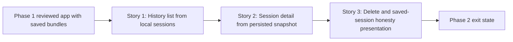

# Story Map: Phase 2 - Saved Sessions Feel Like a Product

**Date**: 2026-04-22
**Phase Plan**: `history/native-macos-meeting-recorder/phase-plan.md`
**Phase Contract**: `history/native-macos-meeting-recorder/phase-2-contract.md`
**Approach Reference**: `history/native-macos-meeting-recorder/approach.md`

---

## 1. Story Dependency Diagram

---

## 2. Story Table

| Story | What Happens In This Story | Why Now | Contributes To | Creates | Unlocks | Done Looks Like |
|-------|-----------------------------|---------|----------------|---------|---------|-----------------|
| Story 1: History list from local sessions | The app can discover saved bundles and render them as real history rows in the existing browse-only screen | The user cannot reopen anything until the app can find and summarize saved sessions | Exit-state lines 1, 2, and 3, plus locked decisions `D4`, `D5`, and `D9` | Read-side session summary models, list loading, row rendering, refresh hooks | Story 2 can open a real selected session instead of a placeholder | Relaunching the app shows actual saved sessions in history, including incomplete ones |
| Story 2: Session detail from persisted snapshot | Opening a saved session shows the persisted transcript snapshot and metadata in the detail destination | The product promise is not complete with a list alone; the user needs to inspect a saved session | Exit-state line 4, plus locked decisions `D3`, `D8`, and `D23` | Selected-session state, detail loading, transcript rendering, metadata formatting | Story 3 can attach delete and honesty presentation to one selected-session model | Selecting a session opens a read-only transcript-plus-metadata detail screen |
| Story 3: Delete and saved-session honesty presentation | The user can delete sessions locally, incomplete state stays visible, and the Phase 2 UI gains a concrete saved-session warning surface | This closes the saved-session loop and keeps the app honest about what was saved without waiting on later review enhancers | Exit-state lines 3, 5, and 6, plus locked decisions `D5`, `D10`, `D19`, and the saved-session implications of `D23` | Delete actions, list/detail refresh after removal, incomplete-state presentation, and warning presentation hooks for saved-session honesty | Phase 3 can focus on hardening instead of missing saved-session product behavior | A session can be deleted cleanly and the remaining saved-session state stays honest |

---

## 3. Story Details

### Story 1: History list from local sessions

- **What Happens In This Story**: `SessionRepository` grows a read-side list API, the app loads real session summaries from disk, and the history screen stops being a shell.
- **Why Now**: the saved-session experience starts with being able to see what exists; without that, Phase 2 has no believable entry point.
- **Contributes To**: real saved-session browsing, incomplete-session visibility, and the locked browse-only row contract.
- **Creates**: public session summary DTOs, list sorting, refresh hooks, and history row rendering.
- **Unlocks**: selected-session navigation and detail loading.
- **Done Looks Like**: the user reopens the app and sees real saved sessions in the history list instead of placeholder copy.
- **Candidate Bead Themes**:
  - session repository read-side and history list wiring

### Story 2: Session detail from persisted snapshot

- **What Happens In This Story**: selecting a saved session opens the detail destination, which renders the transcript snapshot and metadata stored in the bundle.
- **Why Now**: once the user can browse sessions, the next believable product action is to inspect one of them in detail.
- **Contributes To**: the saved-session detail experience staying read-only and faithful to the persisted snapshot contract.
- **Creates**: selected-session app state, detail DTOs, transcript rendering, and metadata presentation.
- **Unlocks**: delete flow and saved-session warning surfacing tied to a real selection model.
- **Done Looks Like**: tapping a history row opens a transcript-plus-metadata screen that clearly reflects the saved session.
- **Candidate Bead Themes**:
  - session selection and detail rendering

### Story 3: Delete and saved-session honesty presentation

- **What Happens In This Story**: saved sessions can be deleted from local storage, incomplete sessions remain clearly marked, and the UI gains a real warning surface for saved-session status messaging.
- **Why Now**: this is the last step that makes the saved-session loop feel intentional instead of like passive file browsing.
- **Contributes To**: local-only ownership, incomplete-session clarity, and honest saved-session state.
- **Creates**: delete actions, refresh-after-delete flow, and saved-session warning presentation hooks that later review follow-ups can reuse.
- **Unlocks**: hardening work that focuses on verification and trust rather than missing product behaviors.
- **Done Looks Like**: a saved session can be removed cleanly, incomplete status is obvious, and the UI has a real home for saved-session warnings without depending on future marker-writing work.
- **Candidate Bead Themes**:
  - delete flow and saved-session honesty presentation

---

## 4. Story Order Check

- [x] Story 1 is obviously first
- [x] Every later story builds on or de-risks an earlier story
- [x] If every story reaches "Done Looks Like", the phase exit state should be true

---

## 5. Decision Coverage

| Locked Decision | Why It Matters In Phase 2 | Story | Bead |
|----------------|----------------------------|-------|------|
| `D3` | Detail remains read-only | Story 2 | `bd-2pg` |
| `D4` | History rows must stay simple and scan-friendly | Story 1 | `bd-28c` |
| `D5` | Incomplete sessions must surface clearly | Story 1 / Story 3 | `bd-28c`, `bd-a27` |
| `D8` | Detail is transcript plus metadata only | Story 2 | `bd-2pg` |
| `D9` | History stays browse-only | Story 1 | `bd-28c` |
| `D10` | Saved sessions are local-only | Story 3 | `bd-a27` |
| `D19` | Delete is required in v1 | Story 3 | `bd-a27` |
| `D23` | Saved detail must show the exact persisted transcript snapshot | Story 2 / Story 3 | `bd-2pg`, `bd-a27` |

---

## 6. Current-Phase Constraints

- The Phase 1 session bundle contract is already real and should be consumed rather than redesigned.
- The app shell already exists, so Phase 2 should deepen the current navigation/state model instead of replacing it.
- `bd-2ap` and `bd-15x` remain later write-side enhancers for richer saved-session honesty markers; Story 3 should leave room for them without making the phase depend on their closure.
- Phase 2 does not need a new spike path because the remaining work is medium-risk UI, read-side, and repository shaping over known local files.

---

## 7. Story-To-Bead Mapping

| Story | Beads | Notes |
|-------|-------|-------|
| Story 1: History list from local sessions | `bd-28c` | Owns repository read-side summaries plus real history rendering |
| Story 2: Session detail from persisted snapshot | `bd-2pg` | Depends on `bd-28c` and adds selected-session state plus transcript-plus-metadata detail rendering |
| Story 3: Delete and saved-session honesty presentation | `bd-a27` | Depends on `bd-2pg` and establishes the delete flow plus the saved-session warning surface that later review beads can enrich |
