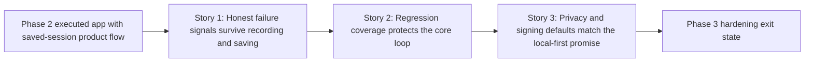

# Phase Contract: Phase 3 - Hardening and Release Trust

**Date**: 2026-04-23
**Feature**: `native-macos-meeting-recorder`
**Phase Plan Reference**: `history/native-macos-meeting-recorder/phase-plan.md`
**Based on**:
- `history/native-macos-meeting-recorder/CONTEXT.md`
- `history/native-macos-meeting-recorder/discovery.md`
- `history/native-macos-meeting-recorder/approach.md`

---

## 1. What This Phase Changes

This phase makes Meetless trustworthy instead of merely feature-complete. After it lands, the app no longer silently looks healthy when transcript coverage or transcript snapshot persistence has degraded, the core recording/save behavior has real regression coverage, and the build/runtime privacy story matches what the product implies about local-only recording.

---

## 2. Why This Phase Exists Now

- Phase 1 proved the recorder and local bundle contract.
- Phase 2 proved the saved-session product loop.
- The remaining open work is review-driven hardening, so the next meaningful slice is to close those trust gaps before more execution, review, or release work.

---

## 3. Entry State

- The app builds and Phase 2 execution is complete.
- Users can already record, save, browse, open, and delete local sessions.
- Recording, History, and Session Detail already contain warning presentation surfaces.
- The remaining open review beads are:
  - `bd-2ap`
  - `bd-15x`
  - `bd-3sy`
  - `bd-2w7`
  - `bd-1ov`
- `xcodebuild -list -project Meetless.xcodeproj` still shows only the `Meetless` target and scheme.
- `Meetless.xcodeproj/project.pbxproj` still enables App Sandbox while disabling code signing in Debug and Release.
- Public logs still include full artifact directory paths in at least the capture and recording layers.

---

## 4. Exit State

- A retry-exhausted transcript lane marks the affected source as degraded in live recording state and leaves an honest saved-session signal instead of failing silently.
- A transcript snapshot write failure becomes visible in recording state and persisted metadata instead of disappearing behind `try?`.
- The repo has a working XCTest target and a reproducible `xcodebuild test` path that covers the highest-value Phase 1 / Phase 3 invariants.
- The app has explicit signing/entitlements configuration so sandbox behavior is actually enforced when enabled.
- Public logs no longer expose full artifact directory paths or equivalent local storage details as public values.

**Rule:** every exit-state line must be testable or demonstrable.

---

## 5. Demo Walkthrough

A reviewer exercises one recording failure path where a transcript lane gives up after repeated retry failure and another where transcript snapshot persistence fails. The app stays bounded, but the operator now sees honest degraded-state messaging and the saved session carries matching warning signals. Then the reviewer runs `xcodebuild test`, builds the signed app configuration, and inspects logs to confirm that storage details are no longer emitted as public artifact paths.

### Demo Checklist

- [ ] Trigger a retry-exhausted transcript path and confirm the affected source is visibly degraded during recording and in the saved session.
- [ ] Trigger a transcript snapshot write failure and confirm the app surfaces it in recording state and persisted session honesty markers.
- [ ] Run `xcodebuild test` successfully against the new XCTest target.
- [ ] Verify the intended signing/entitlements configuration is present and active when sandboxing is enabled.
- [ ] Confirm public logs no longer contain full artifact directory paths.

---

## 6. Story Sequence At A Glance

| Story | What Happens | Why Now | Unlocks Next | Done Looks Like |
|-------|--------------|---------|--------------|-----------------|
| Story 1: Honest failure signals survive recording and saving | The app stops hiding the two remaining recording/persistence truth gaps and carries honest degraded signals into live and saved state | These are the most important remaining product-trust failures, and later tests should lock the corrected behavior in place | Story 2 can encode the right contract instead of the buggy one | A partial transcript lane or stale transcript snapshot no longer looks healthy |
| Story 2: Regression coverage protects the core loop | Meetless gains its first working XCTest path for the fragile recording/persistence invariants | Once Story 1 settles the intended behavior, tests can protect it from future regressions | Story 3 can change project/runtime settings without leaving the core loop manual-only | `xcodebuild test` works and covers the highest-value invariants |
| Story 3: Privacy and signing defaults match the local-first promise | Signing/entitlements and public logs now reflect the product’s local-only privacy story | This is the final trust layer after behavior and tests are in place | Final validation and review can focus on proof, not missing guardrails | The app’s sandbox/signing contract is real and logs avoid leaking local artifact paths |

---

## 7. Phase Diagram

---

## 8. Out Of Scope

- No new capture architecture, playback UI, export flow, transcript editing, or search/filter work belongs in this phase.
- This phase does not redesign the app shell or persistence model; it hardens the current one.
- Performance optimization beyond the current review findings stays out of scope unless validation surfaces a concrete blocker.
- Release packaging, notarization, and broader distribution workflow remain later closeout work after this hardening phase.

---

## 9. Success Signals

- The app is honest about partial or stale transcript state instead of silently presenting a clean story.
- The most fragile recorder/save invariants are executable, not only manual.
- The repo’s project settings and logs now support the app’s local-first privacy narrative.
- A validator can trace every remaining hardening task from this phase contract into the real bead graph.

---

## 10. Failure / Pivot Signals

- Story 1 requires a wider persistence redesign instead of a bounded status/metadata extension.
- Adding the first XCTest target exposes a much larger testability refactor than expected.
- Signing and sandbox enforcement materially change storage assumptions beyond the current app design.
- Public-log redaction removes too much debugging value unless the app first gains better non-sensitive identifiers.
