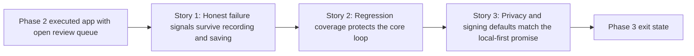

# Story Map: Phase 3 - Hardening and Release Trust

**Date**: 2026-04-23
**Phase Plan**: `history/native-macos-meeting-recorder/phase-plan.md`
**Phase Contract**: `history/native-macos-meeting-recorder/phase-3-contract.md`
**Approach Reference**: `history/native-macos-meeting-recorder/approach.md`

---

## 1. Story Dependency Diagram

---

## 2. Story Table

| Story | What Happens In This Story | Why Now | Contributes To | Creates | Unlocks | Done Looks Like |
|-------|-----------------------------|---------|----------------|---------|---------|-----------------|
| Story 1: Honest failure signals survive recording and saving | The app surfaces retry-exhausted transcript-lane loss and transcript snapshot persistence failures as real live/saved warnings instead of silent drift | These are the last major product-truth gaps, and later tests should lock the corrected behavior instead of the current bugs | Exit-state lines 1 and 2, plus locked decisions `D15`, `D23`, and the durability implications of `D11` | Honest degraded source state, persisted warning markers, and bounded failure handling | Story 2 can encode the correct contract in tests | A degraded source lane or stale snapshot becomes visible in recording and in saved-session honesty surfaces |
| Story 2: Regression coverage protects the core loop | Meetless gains a real XCTest target and focused automated coverage for the highest-value recording/persistence invariants | After Story 1 defines the intended truth contract, tests should make it durable | Exit-state line 3 and the phase-level trust goal that the core loop is no longer manual-only | `MeetlessTests`, project wiring for `xcodebuild test`, and focused regression cases | Story 3 can adjust project/runtime settings without leaving behavior coverage manual-only | `xcodebuild test` passes and covers the most fragile hardening invariants |
| Story 3: Privacy and signing defaults match the local-first promise | The app restores real signing/entitlements behavior and stops exposing full artifact paths in public logs | This closes the final runtime/privacy trust gap after behavior and tests are in place | Exit-state lines 4 and 5, plus the local-only intent behind `D10` and the privacy weight of `D11` | Explicit entitlements config, signed sandbox behavior, and path-safe public logging | Final validation, review closure, and release-readiness proof | Sandbox/signing behavior is real and public logs no longer leak local artifact paths |

---

## 3. Story Details

### Story 1: Honest failure signals survive recording and saving

- **What Happens In This Story**: the recording/persistence path stops silently losing truth when a transcript lane is dropped after retry exhaustion or when transcript snapshot refresh fails on disk.
- **Why Now**: these are the two remaining places where the app can look healthier than it really is, which undermines the trust value of everything already built.
- **Contributes To**: honest degraded-state handling in both live recording and saved-session views.
- **Creates**: persisted honesty markers, clearer degraded-state propagation, and one corrected failure contract for later tests.
- **Unlocks**: regression coverage that encodes the right behavior.
- **Done Looks Like**: the operator can tell when transcript coverage became partial or when the saved snapshot fell behind because persistence degraded.
- **Candidate Bead Themes**:
  - transcript-lane retry-exhaustion honesty
  - transcript snapshot persistence failure honesty

### Story 2: Regression coverage protects the core loop

- **What Happens In This Story**: the repo gains its first working XCTest path and uses it to cover the core recording/persistence behaviors most likely to regress.
- **Why Now**: once Story 1 lands, the intended hardening contract should become executable before more project/runtime changes happen.
- **Contributes To**: confidence that the Phase 1 and Phase 3 state-machine behaviors stay stable.
- **Creates**: `MeetlessTests`, project-file wiring, and regression cases for recording/persistence invariants.
- **Unlocks**: safer project/runtime hardening in Story 3 and cleaner validation later.
- **Done Looks Like**: reviewers can run `xcodebuild test` and trust it to catch the most important hardening regressions.
- **Candidate Bead Themes**:
  - XCTest target and high-value regression coverage

### Story 3: Privacy and signing defaults match the local-first promise

- **What Happens In This Story**: the repo restores meaningful sandbox/signing behavior and removes full artifact paths from public logs.
- **Why Now**: after the product behavior is honest and covered by tests, the last trust gap is the runtime/privacy contract itself.
- **Contributes To**: real privacy alignment for local-only raw audio storage and cleaner observability hygiene.
- **Creates**: explicit entitlements configuration, signed sandbox verification, and safer public log output.
- **Unlocks**: final validation and review closure without lingering privacy/story contradictions.
- **Done Looks Like**: the runtime storage/privacy settings are real, and support logs no longer expose local artifact directory paths.
- **Spike Result**: `bd-172` answered the feasibility question with **YES**. A forced signed local Debug build succeeded, sandbox entitlements were present on the built app, and the remaining work narrowed to explicit entitlements wiring plus runtime container-path verification.
- **Candidate Bead Themes**:
  - signing and sandbox restoration
  - public log redaction

---

## 4. Story Order Check

- [x] Story 1 is obviously first
- [x] Every later story builds on or de-risks an earlier story
- [x] If every story reaches "Done Looks Like", the phase exit state should be true

---

## 5. Decision Coverage

| Locked Decision | Why It Matters In Phase 3 | Story | Bead |
|----------------|----------------------------|-------|------|
| `D15` | The app must clearly surface degraded state when one source lane stops being trustworthy | Story 1 | `bd-2ap` |
| `D23` | The saved transcript remains the exact visible snapshot, even when it is partial or imperfect | Story 1 | `bd-2ap`, `bd-15x` |
| `D11` | Raw audio remains durable while transcript honesty must stay explicit | Story 1 / Story 3 | `bd-15x`, `bd-2w7` |
| `D10` | Local-only storage raises the importance of real sandbox/privacy alignment | Story 3 | `bd-2w7`, `bd-1ov` |
| `D3` / `D8` | Hardening should not drift into editing/playback while improving trust | Story 1 | `bd-2ap`, `bd-15x` |

---

## 6. Current-Phase Constraints

- The warning surfaces already exist in recording, history, and session detail, so Story 1 should feed those seams instead of inventing parallel UI.
- `MeetlessApp/Features/Recording/RecordingViewModel.swift` and `MeetlessApp/Services/SessionRepository/SessionRepository.swift` are shared-file hotspots, so Story 1 beads should stay ordered.
- `Meetless.xcodeproj/project.pbxproj` is a shared-file hotspot for both Story 2 and Story 3, which is another reason to keep the phase mostly serial.
- The only HIGH-risk component in this phase is signing/entitlements restoration (`bd-2w7`).
- The HIGH-risk signing seam is now spike-backed by `bd-172`; execution should treat the remaining risk as configuration and runtime verification, not architecture feasibility.

---

## 7. Story-To-Bead Mapping

| Story | Beads | Notes |
|-------|-------|-------|
| Story 1: Honest failure signals survive recording and saving | `bd-2ap`, `bd-15x` | `bd-2ap` establishes degraded transcript-lane honesty first; `bd-15x` then extends the same honest-state path to snapshot-write failures |
| Story 2: Regression coverage protects the core loop | `bd-3sy` | Depends on Story 1 so tests encode the corrected behavior instead of the bugs |
| Story 3: Privacy and signing defaults match the local-first promise | `bd-2w7`, `bd-1ov` | `bd-2w7` restores the real sandbox/signing contract first; `bd-1ov` then finishes the public-log privacy cleanup on top of that runtime-trust pass |
