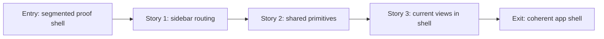

# Phase Contract: Phase 1 - One Coherent App Shell

**Date**: 2026-04-24
**Feature**: `meetless-ui-ux-revamp`
**Phase Plan Reference**: `history/native-macos-meeting-recorder/ui-ux-revamp/phase-plan.md`
**Based on**:
- `history/native-macos-meeting-recorder/CONTEXT.md`
- `history/native-macos-meeting-recorder/design/design.json`
- `history/native-macos-meeting-recorder/ui-ux-revamp/discovery.md`
- `history/native-macos-meeting-recorder/ui-ux-revamp/approach.md`

---

## 1. What This Phase Changes

Phase 1 gives Meetless the approved app frame. The user should see one native macOS utility with a soft gray sidebar, sparse toolbar, quiet local status, and white content canvas instead of a segmented toolbar over a gradient proof shell.

This phase does not redesign each feature surface completely. It creates the shared place where Record, active Recording, Saved Sessions, and Session Detail will live.

---

## 2. Why This Phase Exists Now

- Every later UI change depends on the same shell, spacing, navigation, toolbar, and local-status language.
- The current segmented navigation can bypass `AppModel.show(...)` side effects, so shell work should also make navigation paths more consistent.
- Building view-specific polish before the shell would duplicate layout decisions and make the final app feel stitched together.

---

## 3. Entry State

- `MeetlessRootView` uses `NavigationStack`, a gradient background, and a segmented toolbar picker.
- Record/Home, History, and Session Detail already render through `AppModel`.
- Start/Stop recording, history refresh, session detail loading, and delete behavior already exist.
- The approved design contract requires a persistent sidebar, toolbar, white canvas, hairline dividers, and quiet local status.

---

## 4. Exit State

- Record, Sessions, and Session Detail all render inside one shared shell.
- The segmented toolbar picker and gradient proof-shell presentation are gone from the primary UI.
- Sidebar navigation uses the same routing side effects as existing `AppModel.show(...)` paths.
- The shell includes compact sidebar rows, sparse toolbar area, white content canvas, hairline separation, and a quiet `Local` status footer.
- Existing behavior still works: switching to Sessions refreshes history, opening detail loads the selected session, Back returns to Sessions, and delete still routes through `AppModel`.

---

## 5. Demo Walkthrough

A user launches Meetless and sees the approved shell. They can switch from Record to Sessions using the sidebar, open a saved session detail, go back to Sessions, and return to Record without seeing the old segmented proof toolbar or losing existing refresh/detail behavior.

### Demo Checklist

- [ ] Launch Meetless and confirm the sidebar shell appears.
- [ ] Switch to Sessions from the sidebar and confirm history refreshes.
- [ ] Open a session detail and confirm the shell remains consistent.
- [ ] Return to Sessions and Record without stale selection or broken callbacks.

---

## 6. Story Sequence At A Glance

| Story | What Happens | Why Now | Unlocks Next | Done Looks Like |
|-------|--------------|---------|--------------|-----------------|
| Story 1: Route navigation through the sidebar shell | The old segmented toolbar gives way to persistent sidebar navigation that still calls the real app router | Navigation is the skeleton of the shell | Shared shell can safely host current views | Record/Sessions/Detail switch inside the new shell with correct side effects |
| Story 2: Add shared visual primitives | Status dots, local footer, dividers, colors, spacing, typography, and toolbar/content surfaces become reusable | The shell needs common pieces before screens use them | Feature views can adopt the same visual language | Shared components render the target shell without feature-specific rewrites |
| Story 3: Fit existing views inside the shell | Current feature views are placed into the white canvas with minimal adapters | This proves the shell does not break behavior | Phase 2 can redesign Record/Recording inside a stable frame | Existing user flows still work inside the new app frame |

---

## 7. Phase Diagram

---

## 8. Out Of Scope

- Rewriting the active recording panel.
- Rewriting saved sessions as a final table.
- Rewriting session detail into the final two-column layout.
- Changing recording, capture, whisper, session repository, or persistence logic.
- Adding export, sharing, playback, transcript editing, search, filters, or a real Settings feature.

---

## 9. Success Signals

- The app visually matches the target shell direction before individual screens are fully polished.
- Navigation behavior is no worse than today and preferably more consistent.
- The shell can host every current user-facing view without product behavior changes.
- Review can clearly say Phase 2 is now ready to focus only on Record/Recording polish.

---

## 10. Failure / Pivot Signals

- The shell requires changes to recording or persistence services to render.
- Sidebar navigation cannot preserve `AppModel.show(...)` side effects.
- The visual shell creates cramped or overlapping content at the minimum window size.
- A Settings item creates pressure to add new settings behavior instead of acting as visual shell parity.
