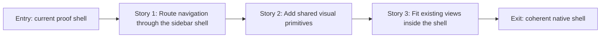

# Story Map: Phase 1 - One Coherent App Shell

**Date**: 2026-04-24
**Phase Plan**: `history/native-macos-meeting-recorder/ui-ux-revamp/phase-plan.md`
**Phase Contract**: `history/native-macos-meeting-recorder/ui-ux-revamp/phase-1-contract.md`
**Approach Reference**: `history/native-macos-meeting-recorder/ui-ux-revamp/approach.md`

---

## 1. Story Dependency Diagram

---

## 2. Story Table

| Story | What Happens In This Story | Why Now | Contributes To | Creates | Unlocks | Done Looks Like |
|-------|-----------------------------|---------|----------------|---------|---------|-----------------|
| Story 1: Route navigation through the sidebar shell | Replace the segmented toolbar navigation with sidebar navigation that calls the same app routing behavior as existing buttons | The shell cannot be trusted until navigation is stable | All views render inside one shared shell and preserve screen side effects | `MeetlessShellView` / `SidebarNavigation` skeleton and router binding | Shared visual primitives can be added around a stable frame | Record, Sessions, and Session Detail are reachable from the sidebar without stale history/detail behavior |
| Story 2: Add shared visual primitives | Add the small reusable pieces that make the shell feel like the approved design | The shell needs common tokens before feature screens adopt them | The app shell has consistent color, spacing, dividers, local status, and toolbar treatment | `MeetlessDesignTokens`, `StatusDot`, `LocalStatusFooter`, toolbar/canvas helpers | Existing views can be placed into the shell without each inventing style | The shell visually matches the target direction at default and minimum sizes |
| Story 3: Fit existing views inside the shell | Place current Record, Sessions, and Detail content into the white canvas with minimal adapters | This proves the shell is safe before screen-specific redesign begins | Existing product behavior remains intact after shell restructure | Root composition that hosts current views inside the shell | Phase 2 can redesign Record and Recording without navigation churn | Build/test pass and manual navigation smoke checks pass |

---

## 3. Story Details

### Story 1: Route Navigation Through The Sidebar Shell

- **What Happens In This Story**: Meetless gets persistent sidebar navigation for Record and Sessions, with Session Detail still reachable through existing session selection.
- **Why Now**: Navigation owns the user's mental model and the existing segmented picker can bypass router side effects.
- **Contributes To**: one shared shell and preserved app behavior.
- **Creates**: shell skeleton, sidebar navigation rows, router binding through `AppModel.show(...)`.
- **Unlocks**: shared visual primitives can be applied to a stable frame.
- **Done Looks Like**: switching screens through the sidebar refreshes Sessions and preserves Session Detail behavior.
- **Candidate Bead Themes**:
  - Shell skeleton and sidebar routing.
  - AppScreen label/icon cleanup for Record/Sessions naming.

### Story 2: Add Shared Visual Primitives

- **What Happens In This Story**: The approved design language becomes reusable SwiftUI pieces instead of one-off styling.
- **Why Now**: The shell needs stable building blocks before feature views adopt the look.
- **Contributes To**: consistent shell surface and future view polish.
- **Creates**: design tokens, status dot, local footer, separator/canvas/toolbar helpers.
- **Unlocks**: current feature views can be hosted without duplicating visual decisions.
- **Done Looks Like**: sidebar, footer, toolbar, dividers, and canvas match the design direction with no feature rewrite.
- **Candidate Bead Themes**:
  - Design tokens and reusable status/footer controls.
  - Toolbar/canvas/hairline divider treatment.

### Story 3: Fit Existing Views Inside The Shell

- **What Happens In This Story**: Current user-facing views render inside the new shell with only the minimum adapters needed to avoid broken layout.
- **Why Now**: The team needs proof that the shell preserves behavior before Phase 2 changes the Record/Recording content.
- **Contributes To**: phase exit state that every existing user-facing surface survives the shell migration.
- **Creates**: root composition that hosts Home, History, and Session Detail in the new canvas.
- **Unlocks**: Phase 2 Record/Recording redesign.
- **Done Looks Like**: build/test plus manual navigation smoke checks pass with no behavior regressions.
- **Candidate Bead Themes**:
  - Root composition and view embedding.
  - Build/manual verification for shell behavior.

---

## 4. Story Order Check

- [x] Story 1 is obviously first because navigation defines the shell.
- [x] Every later story builds on or de-risks an earlier story.
- [x] If every story reaches "Done Looks Like", the phase exit state should be true.

---

## 5. File Ownership During Execution

Phase 1 is intentionally sequential. The file handoff is:

- `bd-39f` owns root routing and shell skeleton work, especially `MeetlessRootView.swift`, `AppModel.swift` if needed, `AppScreen.swift` if needed, and first-pass `MeetlessShellView` / `SidebarNavigation`.
- `bd-2ze` owns new visual primitives and token adoption. It may touch shell/sidebar files only to apply visual tokens created in this story, and should not rewrite routing.
- `bd-2e1` owns minimal feature-view compatibility after the shell exists. It may touch `HomeView.swift`, `HistoryView.swift`, and `SessionDetailView.swift` only enough to make current content fit the shell, and should not redesign those screens.

Shared files are therefore ordered through `bd-39f -> bd-2ze -> bd-2e1`; no two current-phase beads are intended to run in parallel against the same file.

---

## 6. Story-To-Bead Mapping

| Story | Beads | Notes |
|-------|-------|-------|
| Story 1: Route navigation through the sidebar shell | `bd-39f` | Owns root shell routing and sidebar selection behavior |
| Story 2: Add shared visual primitives | `bd-2ze` | Depends on `bd-39f`; owns shared visual components only |
| Story 3: Fit existing views inside the shell | `bd-2e1` | Depends on `bd-2ze`; owns embedding current views and validation smoke checks |
