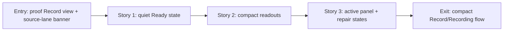

# Phase Contract: Phase 2 - Record And Recording Become Compact

**Date**: 2026-04-24
**Feature**: `meetless-ui-ux-revamp`
**Phase Plan Reference**: `history/native-macos-meeting-recorder/ui-ux-revamp/phase-plan.md`
**Based on**:
- `history/native-macos-meeting-recorder/CONTEXT.md`
- `history/native-macos-meeting-recorder/design/design.json`
- `history/native-macos-meeting-recorder/ui-ux-revamp/discovery.md`
- `history/native-macos-meeting-recorder/ui-ux-revamp/approach.md`
- Phase 1 shell commits: `2022672`, `ebd71b8`, `c1ceb10`

---

## 1. What This Phase Changes

Phase 2 makes the Record tab feel like the approved Meetless recorder. Before recording, the screen should be quiet: a Ready label, a short local-first line, one Start button, and compact local status. While recording, the same tab should show a compact active panel with a red recording dot, elapsed timer, Stop button, waveform/audio activity, a concise health strip, and transcript rows.

This phase keeps the real recording, permission, transcript, and saved-session behavior intact. It changes how the user sees the flow, not what the flow does.

---

## 2. Why This Phase Exists Now

- Phase 1 already gave Record a stable shell, sidebar, toolbar, white canvas, and visual tokens.
- Record and active Recording are the app's daily-use center, so they should become compact before Saved Sessions and Detail polish.
- The approved design asks the primary UI to stop showing `Meeting` / `Me` source lanes, but the underlying two-source model must remain untouched.
- Phase 3 can reuse the transcript-row and status primitives created here.

---

## 3. Entry State

- `HomeView` still shows proof-era copy, a large material card, a visible smoke transcription action, and a broad status banner.
- `RecordingStatusBanner` still shows large source cards with `Meeting` and `Me` labels, verbose latest-event text, and transcript cards.
- `RecordingViewModel` already owns Start/Stop, blocked permission state, polling, repair actions, source statuses, and transcript chunks.
- Phase 1 design tokens and shell primitives exist in `MeetlessApp/Design`.

---

## 4. Exit State

- The Record idle state matches the target ready view: centered, compact, one prominent Start action, quiet local status, no proof/debug/smoke UI in the primary screen.
- The active recording state matches the target panel: recording dot, Recording label, elapsed timer, Stop button, waveform/audio activity, active/degraded/blocked status strip, and compact transcript rows.
- Permission repair still blocks recording when needed, but appears as concise repair rows with System Settings links rather than large explanatory panels.
- Degraded recording or transcript states remain honest, but show as compact warnings/status dots rather than source-lane cards.
- Primary transcript rows do not show `Meeting` / `Me` lane badges. Underlying model names and saved artifacts may remain internal.
- Start/Stop, polling, transcript updates, permission repair, and saved-session creation behavior remain unchanged.

---

## 5. Demo Walkthrough

A user opens Meetless on Record and sees a calm Ready screen with a single Start button. They press Start. If permissions are missing, concise repair rows appear and the user can open System Settings. If recording starts, the screen becomes a compact recording panel with timer, waveform, Stop, health strip, and live transcript rows. The user presses Stop and returns to the ready flow without seeing source-lane cards or proof-era copy.

### Demo Checklist

- [ ] Idle Record shows Ready, Start, and compact local status only.
- [ ] Start still calls `RecordingViewModel.toggleRecording`.
- [ ] Blocked permission state still shows each repair action and its System Settings link.
- [ ] Active recording shows timer, Stop, waveform, health strip, and transcript rows.
- [ ] Transcript rows show timestamp plus text without primary `Meeting` / `Me` badges.
- [ ] Stop still finalizes through the existing coordinator/repository path.

---

## 6. Story Sequence At A Glance

| Story | What Happens | Why Now | Unlocks Next | Done Looks Like |
|-------|--------------|---------|--------------|-----------------|
| Story 1: Make Record Ready Quiet | The idle Record view becomes the target ready state with one Start action and compact local status | This is the first thing users see and it can change without touching active recording behavior | Active state can reuse the same screen spacing and button language | No proof copy, smoke UI, history shortcut card, or large material container remains in the primary idle view |
| Story 2: Add Compact Recording Readouts | Waveform and transcript-row components are introduced for the active state | The active panel needs these pieces before the banner can be safely replaced | The large status banner can be rewritten without inventing one-off rows | Reusable waveform and transcript rows render compactly and hide source lane badges |
| Story 3: Replace The Large Recording Banner | Recording, blocked, and degraded states move into one compact panel/repair surface | After the readouts exist, the old source-lane cards can be removed while preserving honesty | Phase 3 can reuse transcript/status pieces for saved sessions and detail | Active recording and repair states are compact, clear, and behavior-preserving |

---

## 7. Phase Diagram

---

## 8. Out Of Scope

- Saved Sessions table redesign.
- Session Detail metadata rail redesign.
- Recording/capture/whisper/session repository behavior changes.
- Export, sharing, playback, transcript editing, search, filters, onboarding, settings, or manual retranscription UI.
- Removing the internal `RecordingSourceKind` model or persisted source artifacts.

---

## 9. Likely Files Touched

- `MeetlessApp/Features/Home/HomeView.swift`
- `MeetlessApp/Features/Home/HomeViewModel.swift`
- `MeetlessApp/Features/Recording/RecordingStatusBanner.swift`
- `MeetlessApp/Features/Recording/RecordingViewModel.swift` only for UI-facing computed display helpers or elapsed-time state if needed
- New `MeetlessApp/Features/Recording/ActiveRecordingPanel.swift`
- New `MeetlessApp/Features/Recording/WaveformMeterView.swift`
- New shared transcript/status row component if the local file structure prefers it
- `Meetless.xcodeproj/project.pbxproj` if new Swift files are added

---

## 10. Risks

- **Elapsed timer risk**: the current view model does not expose a visible elapsed timer. Implementation should add the smallest UI-facing timer support needed without changing recording finalization.
- **Honesty risk**: removing source-lane cards must not hide blocked/degraded states. The compact UI still needs clear warning labels and repair rows.
- **Product-scope risk**: smoke transcription and proof copy should leave the primary UI, but this phase should not introduce new user actions to replace them.
- **Layout risk**: the active panel must stay readable at the Phase 1 minimum window size.

---

## 11. Success Signals

- The Record tab visually matches the top row of the target design image.
- The app still starts, blocks/repairs, records, polls transcript, stops, and saves as before.
- Primary UI no longer exposes `Meeting` / `Me` lane labels.
- The new transcript/readout pieces are reusable enough for Phase 3.

---

## 12. Failure / Pivot Signals

- Compacting the UI requires editing capture, whisper, session repository, or persistence services.
- The app cannot show degraded/blocked state clearly without reintroducing primary source-lane cards.
- Timer/waveform work grows into real audio analysis or recording-engine changes.
- The Ready view still reads like a proof/debug screen after this phase.
