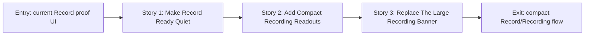

# Story Map: Phase 2 - Record And Recording Become Compact

**Date**: 2026-04-24
**Phase Plan**: `history/native-macos-meeting-recorder/ui-ux-revamp/phase-plan.md`
**Phase Contract**: `history/native-macos-meeting-recorder/ui-ux-revamp/phase-2-contract.md`
**Approach Reference**: `history/native-macos-meeting-recorder/ui-ux-revamp/approach.md`

---

## 1. Story Dependency Diagram

---

## 2. Story Table

| Story | What Happens In This Story | Why Now | Contributes To | Creates | Unlocks | Done Looks Like |
|-------|-----------------------------|---------|----------------|---------|---------|-----------------|
| Story 1: Make Record Ready Quiet | Replace the proof-era Home content with the target Ready state: one Start action, short helper line, and compact local status | Idle Record is the user's first impression and can be simplified before active recording layout changes | Phase exit starts with a minimal, professional ready screen | `RecordReadyView` or equivalent simplified `HomeView` composition | Active recording can use the same spacing, button, and local-status language | Ready screen contains no smoke action, proof copy, shell highlights, source lanes, or large card stack |
| Story 2: Add Compact Recording Readouts | Add waveform and transcript-row components that can render recording activity and live transcript rows compactly | The active panel depends on these pieces and Phase 3 will reuse transcript rows | Phase exit has the visual readouts required by the target design | `WaveformMeterView`, `TranscriptRowsView`, timestamp formatting helpers | The old banner can be replaced without mixing component creation into state rewrite | Transcript rows show timestamp plus text, with no primary `Meeting` / `Me` badges |
| Story 3: Replace The Large Recording Banner | Convert `RecordingStatusBanner` into a compact active panel plus concise blocked/degraded repair surfaces | After readouts exist, source-lane cards can be removed while preserving Start/Stop and warnings | Phase exit state for active recording, permission repair, and degraded health | `ActiveRecordingPanel` or compact banner internals, UI-facing elapsed timer helper if needed | Phase 3 can focus only on Saved Sessions and Detail | Active recording shows dot/timer/waveform/Stop/status strip/transcript rows and still preserves behavior |

---

## 3. Story Details

### Story 1: Make Record Ready Quiet

- **What Happens In This Story**: The Record tab's idle state becomes the approved ready screen: centered title, one-line helper, prominent Start button, and compact Local Status rows.
- **Why Now**: This is the safest first slice because it removes proof-era UI around the existing `RecordingViewModel.toggleRecording` call.
- **Contributes To**: the phase exit state that the primary Record view feels minimal and daily-use friendly.
- **Creates**: a `RecordReadyView` or simplified `HomeView` layout that can host idle, blocked, and active branches.
- **Unlocks**: active recording components can be placed into a clean Record screen.
- **Done Looks Like**: the primary idle UI no longer shows smoke transcription, long implementation copy, shell highlights, source lanes, or history/detail shortcuts.
- **Candidate Bead Themes**:
  - Ready state layout and local status.
  - Remove proof/debug content from primary Home UI.

### Story 2: Add Compact Recording Readouts

- **What Happens In This Story**: The reusable readouts for Phase 2 are added: a restrained waveform meter and timestamp/text transcript rows.
- **Why Now**: The active panel should consume reusable pieces instead of becoming another one-off banner.
- **Contributes To**: compact recording health and transcript display without source-lane cards.
- **Creates**: `WaveformMeterView`, `TranscriptRowsView`, compact timestamp formatting, and simple status-row helpers if needed.
- **Unlocks**: the large `RecordingStatusBanner` can be replaced safely.
- **Done Looks Like**: live transcript chunks can render as compact rows with hairline separators and no primary `Meeting` / `Me` badge.
- **Candidate Bead Themes**:
  - Waveform meter.
  - Transcript rows.

### Story 3: Replace The Large Recording Banner

- **What Happens In This Story**: Active recording, blocked permission repair, and degraded states are presented through compact panels/rows instead of source-lane cards and verbose event panels.
- **Why Now**: The ready screen and readout components now exist, so this story can focus on behavior-preserving state presentation.
- **Contributes To**: the phase exit state for active recording matching the target design.
- **Creates**: `ActiveRecordingPanel` or equivalent compact internals inside `RecordingStatusBanner`, plus UI-facing display helpers in `RecordingViewModel` only if needed.
- **Unlocks**: Phase 3's saved-session table and detail rail can reuse transcript/status presentation patterns.
- **Done Looks Like**: Start, blocked repair, recording, degraded, transcript polling, and Stop all remain intact while the primary UI no longer shows `Meeting` / `Me` lanes.
- **Candidate Bead Themes**:
  - Active panel with timer, Stop, waveform, status strip.
  - Compact repair/degraded states.
  - Final behavior/visual smoke.

---

## 4. Story Order Check

- [x] Story 1 is first because the Ready state is the safest visible slice and removes old proof language.
- [x] Story 2 creates the reusable readouts before replacing the old banner.
- [x] Story 3 closes the phase by moving active/blocked/degraded states into the compact target UI.
- [x] If every story reaches "Done Looks Like", Phase 2's exit state should be true.

---

## 5. File Ownership During Execution

Phase 2 should stay mostly sequential because `HomeView`, `RecordingStatusBanner`, and any shared transcript/readout components are tightly related.

- Story 1 owns `MeetlessApp/Features/Home/HomeView.swift` and `HomeViewModel.swift`.
- Story 2 owns new readout components such as `WaveformMeterView.swift` and `TranscriptRowsView.swift`, plus `Meetless.xcodeproj/project.pbxproj` if new files are added.
- Story 3 owns `RecordingStatusBanner.swift`, `ActiveRecordingPanel.swift`, and small `RecordingViewModel.swift` display helpers if required.

Workers must not touch recording/capture/whisper/session repository services in this phase.

---

## 6. Story-To-Bead Mapping

| Story | Beads | Notes |
|-------|-------|-------|
| Story 1: Make Record Ready Quiet | `bd-1n3` | Owns idle Record/Home simplification |
| Story 2: Add Compact Recording Readouts | `bd-1zo` | Depends on `bd-1n3`; owns reusable waveform/transcript-row pieces |
| Story 3: Replace The Large Recording Banner | `bd-2yh` | Depends on `bd-1zo`; owns active/blocked/degraded recording presentation |
