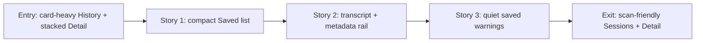

# Phase Contract: Phase 3 - Saved Sessions And Detail Become Scan-Friendly

**Date**: 2026-04-24
**Feature**: `meetless-ui-ux-revamp`
**Phase Plan Reference**: `history/native-macos-meeting-recorder/ui-ux-revamp/phase-plan.md`
**Based on**:
- `history/native-macos-meeting-recorder/CONTEXT.md`
- `history/native-macos-meeting-recorder/design/design.json`
- `history/native-macos-meeting-recorder/design/target-ui-design.png`
- `history/native-macos-meeting-recorder/ui-ux-revamp/phase-1-contract.md`
- `history/native-macos-meeting-recorder/ui-ux-revamp/phase-2-contract.md`
- Phase 2 commits: `0c73456`, `a2b5bbb`, `254ea83`

---

## 1. What This Phase Changes

Phase 3 makes Saved Sessions and Session Detail feel like the approved Meetless app rather than proof screens. Saved Sessions becomes a compact, table-like list for browsing local recordings. Session Detail becomes a reading view: transcript rows on the left, a metadata rail on the right, with Back and Delete as the only real actions.

This phase keeps the saved-session repository, transcript snapshot, metadata, incomplete-session behavior, and delete flow intact. It changes how the user scans and reads saved sessions, not what a saved session is.

---

## 2. Why This Phase Exists Now

- Phase 1 already gave the app one shell, sidebar, toolbar, canvas, and visual tokens.
- Phase 2 already introduced compact transcript rows and recording status primitives.
- History and Detail are now the remaining user-facing surfaces with large proof cards, long explanations, and source-lane presentation.
- Once this phase lands, all four approved views should share the same compact daily-use language.

---

## 3. Entry State

- `HistoryView` still uses large material cards, row cards, row-contract copy, saved-session honesty copy, and prominent Back Home actions.
- `HistoryViewModel` still exposes proof-era subtitle and row-field copy.
- `SessionDetailView` still stacks transcript, notices, metadata, and source health as separate cards.
- Session detail transcript rows still show primary `Meeting` / `Me` labels through `row.source.rawValue`.
- Source health is shown as source-lane rows instead of compact saved warnings.
- `TranscriptRowsView`, `StatusDot`, `HairlineDivider`, and design tokens exist from prior phases.

---

## 4. Exit State

- Saved Sessions matches the target list: Saved title, refresh action, compact rows, columns for name/date/duration/status/action, row separators, session count, and delete still available.
- Saved Sessions has concise loading, empty, and partial-warning states with no large proof cards or long explanatory paragraphs.
- Session Detail matches the target reading view: Back action, Delete action, session title, compact metadata line, transcript rows on the left, metadata rail on the right.
- Detail transcript primary rows use timestamp plus text and do not show primary `Meeting` / `Me` badges.
- Saved warnings and incomplete/corrupt/degraded signals remain visible, but as compact status rows or rail items.
- Delete saved session behavior remains unchanged.
- No playback, export, sharing, transcript editing, search, filters, settings, or manual retranscription UI is added.

---

## 5. Demo Walkthrough

A user opens Sessions and sees a quiet saved list. They can scan names, dates, durations, completion status, and open Detail. If no sessions exist, the empty state is short and points back to recording. If a saved session has warnings, the row stays compact but honest. The user opens a session, reads the transcript on the left, checks local metadata on the right, and can go Back or Delete. They never see playback/export/edit/search/filter controls.

### Demo Checklist

- [ ] Saved Sessions shows compact rows with name, date, duration, status, Detail, and Delete.
- [ ] Refresh still calls the existing reload path.
- [ ] Delete from Sessions still uses the existing delete path and confirmation.
- [ ] Detail opens from a saved row and shows the exact saved transcript snapshot.
- [ ] Detail Delete still uses the existing delete path and confirmation.
- [ ] Primary transcript/detail UI does not expose `Meeting` / `Me` source-lane badges.
- [ ] Incomplete/warning states are visible but visually quiet.

---

## 6. Story Sequence At A Glance

| Story | What Happens | Why Now | Unlocks Next | Done Looks Like |
|-------|--------------|---------|--------------|-----------------|
| Story 1: Make Saved Sessions A Compact List | History becomes the target Saved table/list with concise row states and actions | Users need fast scanning before detail reading matters | Detail can rely on cleaner row selection and status language | No row-contract card, honesty card, heavy row cards, or Back Home primary action remains |
| Story 2: Make Detail A Reading View | Session Detail becomes transcript-left and metadata-right with Back/Delete actions | The detail screen can reuse the transcript row pattern after Sessions is clean | Warning/status presentation can be tightened in one final pass | Transcript and metadata are readable without stacked cards or source badges |
| Story 3: Keep Saved Warnings Quiet And Honest | Incomplete, saved notices, and source health become compact warnings/rail items | Final pass ensures the visual cleanup did not hide important saved-session truth | Phase 3 can validate as a complete user-facing revamp | Warnings are visible, concise, and behavior-preserving |

---

## 7. Phase Diagram

---

## 8. Out Of Scope

- Recording, capture, whisper, transcript coordinator, session repository, or persistence behavior changes.
- Export, sharing, playback, transcript editing, search, filters, settings, or manual retranscription.
- Changing the saved-session schema.
- Removing internal source metadata from saved artifacts.
- Redesigning Record/Home or Active Recording after Phase 2 unless a tiny shared-component integration is required.

---

## 9. Likely Files Touched

- `MeetlessApp/Features/History/HistoryView.swift`
- `MeetlessApp/Features/History/HistoryViewModel.swift`
- `MeetlessApp/Features/SessionDetail/SessionDetailView.swift`
- New `MeetlessApp/Features/History/SessionsTableView.swift` if useful
- New `MeetlessApp/Features/SessionDetail/SessionDetailMetadataRail.swift` if useful
- `Meetless.xcodeproj/project.pbxproj` if new Swift files are added

---

## 10. Risks

- **Behavior drift risk**: compacting History must not break reload, open detail, or delete.
- **Truth hiding risk**: removing large honesty/source cards must not hide incomplete sessions, saved warning notices, or degraded source state.
- **Source-label conflict risk**: `CONTEXT.md` preserves source metadata internally, while the design contract says the primary UI should not expose `Meeting` / `Me` lanes. Implementation should hide primary badges while keeping saved data intact.
- **Layout risk**: two-column detail must remain readable at the Phase 1 minimum window size.

---

## 11. Success Signals

- The bottom two views of `target-ui-design.png` are represented in the real app.
- History and Detail feel like normal macOS utility screens, not onboarding/proof pages.
- The exact saved-session behaviors remain intact.
- `xcodebuild test -project Meetless.xcodeproj -scheme Meetless -destination 'platform=macOS'` passes.

---

## 12. Failure / Pivot Signals

- The phase requires repository or saved-session schema changes.
- Detail cannot show warning/source-health truth without reintroducing large source-lane cards.
- The compact list becomes a new feature surface with search/filter/export/playback controls.
- History or Detail loses delete/open/reload behavior while becoming visually cleaner.
