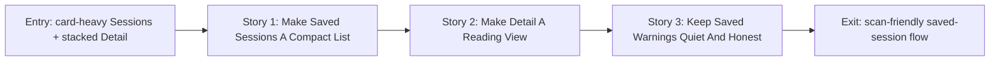

# Story Map: Phase 3 - Saved Sessions And Detail Become Scan-Friendly

**Date**: 2026-04-24
**Phase Plan**: `history/native-macos-meeting-recorder/ui-ux-revamp/phase-plan.md`
**Phase Contract**: `history/native-macos-meeting-recorder/ui-ux-revamp/phase-3-contract.md`
**Approach Reference**: `history/native-macos-meeting-recorder/ui-ux-revamp/approach.md`

---

## 1. Story Dependency Diagram

---

## 2. Story Table

| Story | What Happens In This Story | Why Now | Contributes To | Creates | Unlocks | Done Looks Like |
|-------|-----------------------------|---------|----------------|---------|---------|-----------------|
| Story 1: Make Saved Sessions A Compact List | Replace large History cards with the target Saved list/table rows | The browse surface is the first saved-session screen users see | Phase exit starts with fast scanning | `SessionsTableView` or equivalent compact `HistoryView` composition | Detail can inherit cleaner row status/action language | Saved rows have columns, dividers, Detail/Delete actions, session count, and no proof cards |
| Story 2: Make Detail A Reading View | Convert Detail into transcript-left and metadata-right layout | Detail should read like a document after the list opens a session | Phase exit has the target detail layout | `SessionDetailMetadataRail` or compact detail internals | Final warning pass can tighten honesty/status presentation | Back/Delete, title, compact metadata line, transcript rows, and metadata rail are visible |
| Story 3: Keep Saved Warnings Quiet And Honest | Convert incomplete/saved/source notices into concise status rows or rail items | Final pass ensures visual simplification did not hide important saved-session truth | Phase exit preserves V1 honesty | Compact warning/status pieces for saved sessions | Phase 3 is validation-ready | Incomplete/degraded/warning states are visible without source-lane cards or long paragraphs |

---

## 3. Story Details

### Story 1: Make Saved Sessions A Compact List

- **What Happens In This Story**: The Saved Sessions screen becomes the approved compact list: title, refresh icon/action, table-like rows, session count, and concise empty/loading states.
- **Why Now**: This is the safest first slice because it can keep `HistoryViewModel` and `AppModel` behavior intact while replacing the visible proof-era layout.
- **Contributes To**: users can scan local meetings quickly before opening detail.
- **Creates**: `SessionsTableView` or a simplified `HistoryView` list surface.
- **Unlocks**: Detail can focus on the selected-session reading experience instead of compensating for a noisy list.
- **Done Looks Like**: no row-contract card, no saved-session honesty card, no heavy row cards, no long browse-only explanation, and no primary Back Home action.
- **Candidate Bead Themes**:
  - Compact saved table/list.
  - Concise loading and empty states.
  - Preserve refresh/open/delete.

### Story 2: Make Detail A Reading View

- **What Happens In This Story**: Session Detail becomes a two-column reading surface with transcript rows on the left and metadata on the right.
- **Why Now**: `TranscriptRowsView` already exists from Phase 2, so Detail can reuse the same timestamp/text language.
- **Contributes To**: saved transcripts become easy to read and saved metadata remains available without becoming a grid of cards.
- **Creates**: `SessionDetailMetadataRail` or equivalent compact detail composition.
- **Unlocks**: saved warning and source-health states can be placed into the rail or concise rows.
- **Done Looks Like**: Back and Delete are the only actions; transcript rows do not show primary `Meeting` / `Me` badges; metadata sits in a right rail separated by a hairline divider.
- **Candidate Bead Themes**:
  - Detail two-column layout.
  - Reuse transcript rows.
  - Compact Back/Delete/header actions.

### Story 3: Keep Saved Warnings Quiet And Honest

- **What Happens In This Story**: Incomplete state, saved session notices, and source health are kept visible as compact warnings/status rows.
- **Why Now**: The visual rewrite should end by proving that important saved-session truth did not disappear.
- **Contributes To**: the phase can pass review against D5, D15, D19, and the design contract.
- **Creates**: compact saved warning rows or rail sections.
- **Unlocks**: final review can focus on the complete revamp, not hidden behavior regressions.
- **Done Looks Like**: warning and degraded states are short, visible, and do not reintroduce source-lane cards or long explanatory copy.
- **Candidate Bead Themes**:
  - Incomplete and warning status rows.
  - Compact source-health summaries.
  - Final visual/behavior smoke.

---

## 4. Story Order Check

- [x] Story 1 is first because Saved Sessions is the entry point to saved-session browsing.
- [x] Story 2 follows because Detail opens from the saved list and can reuse Phase 2 transcript rows.
- [x] Story 3 closes the phase by preserving warning honesty after the visual cleanup.
- [x] If every story reaches "Done Looks Like", Phase 3's exit state should be true.

---

## 5. File Ownership During Execution

Phase 3 should stay mostly sequential because `HistoryView`, `SessionDetailView`, and shared saved-session warning presentation are tightly related.

- Story 1 owns `MeetlessApp/Features/History/HistoryView.swift` and `HistoryViewModel.swift`.
- Story 2 owns `MeetlessApp/Features/SessionDetail/SessionDetailView.swift` and a new metadata rail component if useful.
- Story 3 owns final warning/status presentation inside History and Detail, plus any small view-model display helpers required for compact labels.

Workers must not touch recording/capture/whisper/session repository services in this phase.

---

## 6. Story-To-Bead Mapping

| Story | Beads | Notes |
|-------|-------|-------|
| Story 1: Make Saved Sessions A Compact List | `bd-1h1` | Owns History/Saved list simplification |
| Story 2: Make Detail A Reading View | `bd-31j` | Depends on `bd-1h1`; owns Detail layout and metadata rail |
| Story 3: Keep Saved Warnings Quiet And Honest | `bd-bxp` | Depends on `bd-31j`; owns final warning/status honesty pass |
